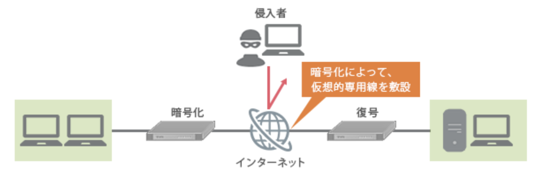
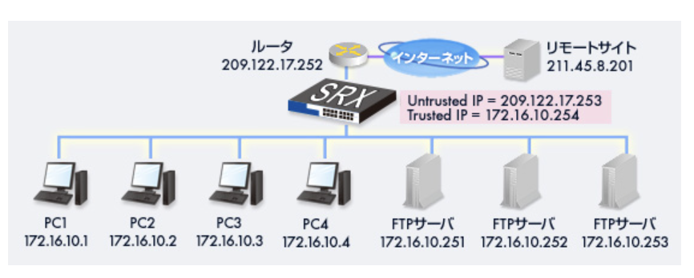
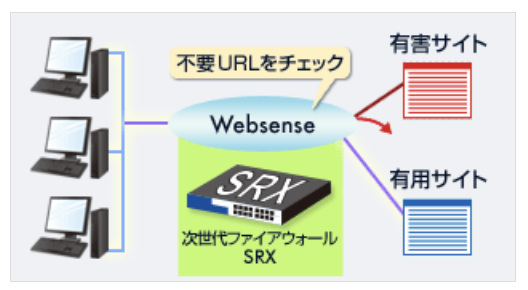

### ファイアウォール

- ファイアウォールとは

企業などの社内ネットワークにインターネットを通して外部から侵入してくる不正アクセスや、社内ネットワークから外部への許可されていない通信から守るための防火壁。WANの発展により、企業内のネットワークをWebに接続することが当たり前になった結果、Ｗeb経由で社内ネットワークに侵入できるようになり、内部データの盗聴、改ざん、攻撃などが行われる可能性が大きくなった。そのため、高度なセキュリティシステムの構築が必要となり、ファイアウォールが誕生した。  
ファイアウォールは、送られてくる通信のパケット(データのかたまり)情報から接続を許可するか判断し、不正アクセスであると判断した際には、管理者に通報できるよう設計されている。またより高いセキュリティを保てるよう々な付加機能を持っているものが多く、様々なネットワークに柔軟に対応できるようになっている

- ファイアウォールの種類と仕組み

ファイアウォールのフィンルタリングの方法は以下の3つ。  
`パケットフィルタリング型`  
ヘッダ(パケットの先頭の、状態を記録している部分)を解析して、通過させるかどうか判断する。パケットごとにフィルタリングルールを設定できるので強力で柔軟性のある制御ができる反面、設定が難しく、セキュリティホール(設定ミスによる抜け穴)が生まれる可能性が高いという欠点がある

`サーキットゲートウェイ型`  
プロキシサーバ経由で接続を行い、パケットフィルタリング型システムの方法に加えポート制御機能をもつ。コネクションごとに認証を行う。アプリケーションプロトコル全てに汎用的に対応できる反面、クライアント側にも専用のソフトウェアが必要となる場合がある

`アプリケーションゲートウェイ型`  
プロキシサーバ経由で接続を行い、サーキットゲートウェイ型システムよりも詳細なアプリケーションプロトコルごとに認証を行う。設定が比較的簡単な反面、サービスごとにしか設定できないため、細かい制御設定が難しいという短所をもつ

### VPN

- VPN(*Virtual Private Network*)接続とは

インターネット上に仮想的な専用網を設置し、安全にデータをやり取りする通信方式のこと。距離が離れた拠点同士の場合、専用線を用意しての通信は多大なコストがかかる。VPN接続なら、インターネットを利用し、論理的には専用線につないで通信しているのと同じ状態を実現することができる

- VPN接続の仕組み

VPN通信を行いたい各拠点に専用のVPN装置を設置し、インターネット上に仮想専用網を構築する。VPN装置を経由することで、データ送信時には暗号化を行ったうえでデータをインターネット上に流し、受信時に復号する

- VPN接続のメリット

`専用線の安全性`と`インターネットの柔軟性`を併せ持っている。安全性は専用線並みなので、第3者に盗み見、改ざんされる恐れのあるような重要なデータも公衆回線で手軽に送信することができる。専用線の敷設・管理に比べて、インターネット通信はコストがかからず、管理も簡単。そのうえ専用線の場合、通信できる相手が固定されてしまうのに対して、インターネット通信では、通信相手も自由に選ぶことができるうえ、携帯端末を用いた通信も可能で、様々な用途に用いる事が考えられる

- VPN接続の種類

`インターネットVPN`  
・一般的なインターネット回線を利用する  
・低コストで利用できる  
・不特定多数の人が利用するため、不正アクセスなどのセキュリティリスクへの対策が必要  
・通信の品質が保証されていない  
`IP-VPN`  
・大手通信事業者の提供する閉鎖網を利用する  
・利用コストが高い  
・利用者が限られているため、セキュリティリスクが低い  
・通信の品質がSLAで定められている

- VPNの用途

`リモートVPN`  
VPNクライアント(VPN機能を持たせるソフトウェア)をインストールすることで、リモートアクセスでVPN接続を利用できる。出張先からの報告、外出先から事業所のサーバへのアクセス、モバイル端末から事業所サーバへのファイルのダウンロード、転送などに使用可能

`部門間VPN`(イントラネットでの利用)  
部門間で、セキュリティレベルの高い通信を必要とする場合に利用できる。また、事業拠点が分散しているような場合でも、VPN接続を利用する事で機密性の高いデータをやり取りする事ができるようになる

`企業間VPN`(エクストラネットでの利用)  
企業間で機密性の高いデータをインターネット経由でやり取りできるようになる。共同研究の際の仕様書、設計書などの交換、生産管理におけるトランザクションや情報伝達(管理)、製品流通に関する情報共有、大口の顧客との受注、付加サービスの提供、電子商取引(EC)の利用が可能

- 暗号化 / 復号の仕組み

`秘密鍵暗号化方式`  
送信者と受信者が同じ鍵を持つ方法。内容を見ることができるのは両者だけなので通信の安全が保証される。両者が離れた場所にいる場合、通信に使用する鍵の情報を何かしらの方法で伝える必要があり、その際に情報が盗まれる可能性がある  
`公開鍵暗号方式`  
2種類の鍵、公開キー(誰でも使用できる鍵)と秘密キー(持っている本人しか使用できない)を一対として使用する方式。送信者は`公開鍵で暗号化`し、受信者は`秘密鍵で復号`する。処理に時間が掛かるため、大量のデータ処理を必要とする回線には不適当な暗号方式

### ファイアウォールをサポートする機能

- NAT(*Network Address Translation* : ネットワークアドレス変換)機能

プロバイダが割り当てるIPアドレスの数より多くのコンピュータがインターネットに接続する必要がある場合に使われる。社内ネットワーク内のコンピュータのIPアドレスが外部に対して隠されるので、IPアドレスの枯渇問題を解決するためのソリューションとしてだけでなく、セキュリティ面でも有効

- Webフィルタリング機能

インターネットには犯罪の窓口になるような問題を含んだサイトが和多く存在している。企業や学校では、このような有害サイトの情報をシャットアウトし、また、教育や業務上不要なデータのダウンロードをなくしネットワークの負荷を軽くすることで、良好な環境を作ることが求められる。国際コンピュータセキュリティ協会(ICSA)の優良フィルタリングソフトウェアに認定された*Websense*は、毎日更新される90カテゴリに分類された世界最大規模のURLデータベースにより、好ましくないサイトや不適切と思われるサイトへのアクセスをSRXシリーズと連携しフィルタリング / 監視する。SRXシリーズなら、別途*Websense*を用意することなく、Webフィルタリングを実施することが可能(要ライセンス)

- イベント監査機能

セキュリティ管理者は、ネットワークの情報を収集し分析する必要がある。監査機能により、セキュリティに関する重大な出来事を発見したり、侵入や悪用を防ぐことができる。SRXシリーズにはシステムイベントログとトラフィックログの取得機能がある。また、NetScreenは*Security Reporting Center*(SRC)と連携することで取得したログを分析、グラフ表示することができる

- GUIの設計

SRXシリーズの各種設定はWebブラウザから行うことができる。アイコンによる設定内容の確認や、ヘルプの表示などにより管理・運用が容易になっている
