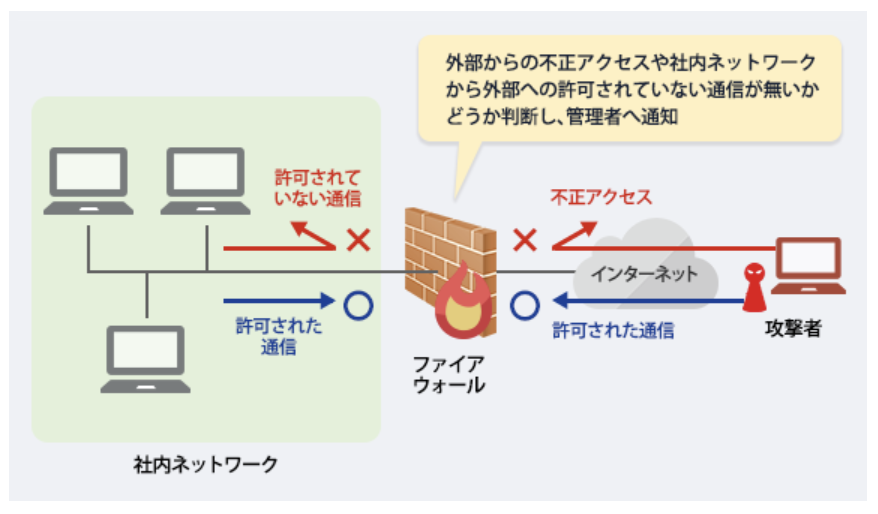

### ファイアウォール編

- ファイアウォールとは

企業などの社内ネットワークにインターネットを通して外部から侵入してくる不正アクセスや、社内ネットワークから外部への許可されていない通信から守るための防火壁。WANの発展により、企業内のネットワークをWebに接続することが当たり前になった結果、Ｗeb経由で社内ネットワークに侵入できるようになり、内部データの盗聴、改ざん、攻撃などが行われる可能性が大きくなった。そのため、高度なセキュリティシステムの構築が必要となり、ファイアウォールが誕生した。  
ファイアウォールは、送られてくる通信のパケット(データのかたまり)情報から接続を許可するか判断し、不正アクセスであると判断した際には、管理者に通報できるよう設計されている。またより高いセキュリティを保てるよう々な付加機能を持っているものが多く、様々なネットワークに柔軟に対応できるようになっている

- ファイアウォールの種類と仕組み

ファイアウォールのフィンルタリングの方法は以下の3つ。  
`パケットフィルタリング型`  
ヘッダ(パケットの先頭の、状態を記録している部分)を解析して、通過させるかどうか判断する。パケットごとにフィルタリングルールを設定できるので強力で柔軟性のある制御ができる反面、設定が難しく、セキュリティホール(設定ミスによる抜け穴)が生まれる可能性が高いという欠点がある

`サーキットゲートウェイ型`  
プロキシサーバ経由で接続を行い、パケットフィルタリング型システムの方法に加えポート制御機能をもつ。コネクションごとに認証を行う。アプリケーションプロトコル全てに汎用的に対応できる反面、クライアント側にも専用のソフトウェアが必要となる場合がある

`アプリケーションゲートウェイ型`  
プロキシサーバ経由で接続を行い、サーキットゲートウェイ型システムよりも詳細なアプリケーションプロトコルごとに認証を行う。設定が比較的簡単な反面、サービスごとにしか設定できないため、細かい制御設定が難しいという短所をもつ
