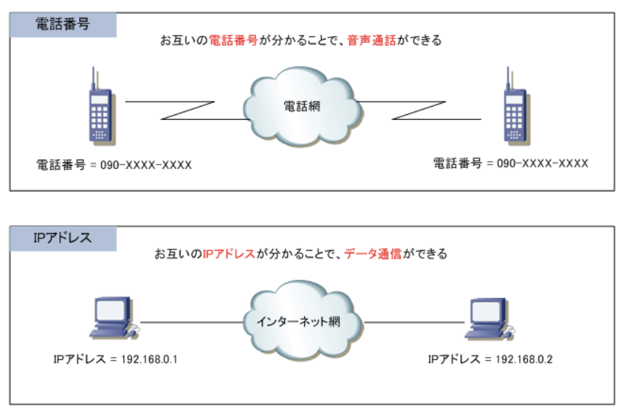

### IPアドレスとは

- IPアドレス

インターネットやLANなどのIPネットワークに接続されたコンピュータなどに割り振られる識別番号のこと。IPアドレスは、IPネットワーク上の住所、電話番号のようなもの。  
コンピュータ内部では2進数で処理されることから、32ビットの整数値で表されるが2進数はわかりにくいため、32ビットの整数値を8ビットずつ4分割して10進数でIPアドレスを表す。  
IPアドレスによって互いの場所を識別しているため、PCとサーバの通信が成立する

