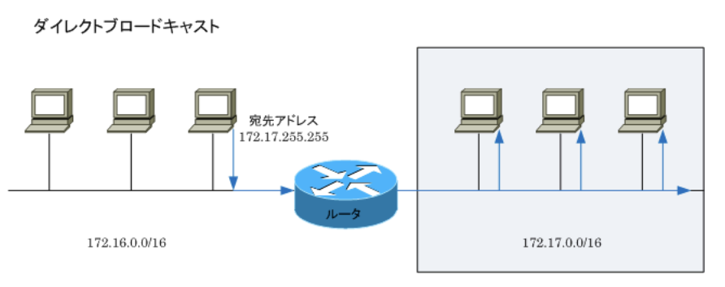

### IPアドレスとは

- IPアドレス

インターネットやLANなどのIPネットワークに接続されたコンピュータなどに割り振られる識別番号のこと。IPアドレスは、IPネットワーク上の住所、電話番号のようなもの。  
コンピュータ内部では2進数で処理されることから、32ビットの整数値で表されるが2進数はわかりにくいため、32ビットの整数値を8ビットずつ4分割して10進数でIPアドレスを表す。  
IPアドレスによって互いの場所を識別しているため、PCとサーバの通信が成立する

- 2種類のIPアドレス - IPv4アドレス、IPv6アドレス

IPアドレスといえば一般的に`IPv4`(*Internet Protocol version 4*)アドレスを指す。IPv4アドレスは世界的に利用者が急増したことにより割り当てるIPアドレスがなくなってきており、それを解消するために開発されたのがIPv6。現在、家庭や企業で最も使用されているのはIPv4アドレス

- 自分が現在使用しているIPアドレス

現在自分が使用しているIPアドレスを確認するためには、Windowsの場合は`ipconfig`と入力。この画像では`192.168.0.1`。macOSの場合は`ipconfig getifaddr en0`コマンドを入力

- IPアドレスの構成

32ビットのIPアドレスは、`ネットワーク部`、`ホスト部`の2つで構成される。ネットワーク部は、各ホストが所属するネットワークを示し、ホスト部はネットワークに所属する各ホストを示す

- IPアドレスのクラス

クラスAからEの5つのアドレスクラスに分類される  
`クラスA` : 0.0.0.0 ~ 126.255.255.255 / 8、大規模ネットワークで使用  
`クラスB` : 128.0.0.0 ~ 191.255.255.255 / 16,
中規模ネットワークで使用  
`クラスC` : 192.0.0.0 ~ 223.255.255.255 / 24、小規模ネットワークで使用  
`クラスD` : 224.0.0.0 ~ 239.255.255.255、下位28bitがマルチキャストグループID、マルチキャスト用のアドレス  
`クラスE` : 240.0.0.0 ~ 255.255.255.255、現在割り当てが定義されていない、実験用のアドレス  
クラスAでは`0.0.0.0 / 8`と`127.0.0.0 / 8`は予約されているため使用できない。また、`ネットワークアドレス`(ホスト部が全て0)と`ブロードキャストアドレス`(ホスト部が全て1)の2つはホストに割り当てられない

### IPアドレス - ネットワークアドレス / ブロードキャストアドレス

- 予約済みIPアドレス

コンピュータなどのホストに割り当てられないアドレスが3種類。`ネットワークアドレス`はホスト部のビットが全て0、`ブロードキャストアドレス`はホスト部のビットが全て1、127.0.0.0 / 8の、`127.0.0.1`を`ループバックアドレス`と呼び、自身を示す仮想的なIPアドレス。`ping 127.0.0.1`で応答があればTCP / IPが正常に動作している

- ブロードキャストアドレスの種類

`ローカルブロードキャストアドレス`は自身が接続しているネットワークのブロードキャストのこと。172.16.0.0 / 16のローカルブロードキャストアドレスは172.16.255.255となる

`ダイレクトブロードキャストアドレス`は自身が接続していないネットワークへのブロードキャストのこと。自身は172.16.0.0 / 16のセグメントに接続していながら、172.17.0.0 / 16の異なるセグメントに対し送出するブロードキャストのこと。以下では172.16.255.255が該当する。セキュリティ上の問題があることから、IPネットワークにおける経路制御装置のルータで転送されないようデフォルトで設定されていることが一般的

### IPアドレス - グローバルIPアドレス / プライベートIPアドレス

- グローバルIPアドレス

グローバルIPアドレスは、インターネットに接続された機器に一意に割り当てられるIPアドレス  
`クラスA` : 1.0.0.0 ~ 9.255.255.255, 11.0.0.0 ~ 126.255.255.255  
`クラスB` : 128.0.0.0 ~ 172.15.255.255, 172.32.0.0 ~ 191.255.255.255  
`クラスC` : 192.0.0.0 ~ 172.167.255.255, 192.169.0.0 ~ 223.255.255.255

- プライベートIPアドレス

会社や家庭などの組織内(ローカル)で一意に割り当てられるIPアドレス。機関に申請せず自由に使えるが、組織内では一意に割り当てる必要がある。このIPアドレスが割り当てられた機器はインターネットでは通信を行えないため、インターネット通信を行うためには、アドレス変換技術などでグローバルIPを持つ機器に中継してもらう必要がある  
`クラスA` : 10.0.0.0 ~ 10.255.255.255  
`クラスB` : 172.16.0.0 ~ 172.31.255.255  
`クラスC` : 192.168.0.0 ~ 192.168.255.255

### VLSM / CIDR / サブネットゼロ

- VLSM(*Variable Length Subnet Mask*)とは

1つのIPネットワークをサブネットに分割する際に、複数の長さのサブネットマスクを利用する技術で、`可変長サブネットマスク`とも呼ばれる。クラスの概念にとらわれない`クラスレスアドレッシング`の手法の1つと言える。`効率的なアドレッシング`が実現できるが、対応していないクラスフルルーティングプロトコル(RIPv1)が稼働しているネットワークでは使用できない

- CIDR(*Classless InterDomain Routing*)とは

IPネットワークの経路情報を集約する際にクラスの概念をなくした技術のこと。CIDRにより複数のクラスCアドレスを1つのネットワークに集約することができ、集約したネットワークは`SuperNet`(元のクラスのナチュラルマスクよりも短いマスクの経路)と呼ぶ。  
これによって、200.0.0.0 / 24 ~ 200.0.7.0 / 24の8つのネットワークを、1つのネットワークに集約して200.0.0.0 / 21として扱うことができる。インターネット上である組織がクラスCのネットワークではIPアドレスが足らないことからクラスBのネットワークを取得を希望した場合、クラスBのネットワークを付与するのではなく、必要としているIPアドレスの数と同じくらいの数となるよう、連続する複数のクラスCのネットワークを、1つのネットワークとして割り当てればIPアドレス空間を有効利用できる

VLSMの場合は複数の異なるサブネットを作成していく時に`ホスト部のビット`を消費していくのに対し、CIDRの場合は複数のネットワークを1つのネットワークにする時に`ネットワーク部のビット`を消費していく。CIDRでは1つの大きなネットワークを作成するためにホスト部のビットを増やしている

- ゼロサブネットとは

サブネット部が全て0のネットワークのこと。172.16.10.0 / 24の場合はサブネット部が全て0ではないが、172.16.0.0 / 24の場合は全て0になり、ゼロサブネットに該当する。従来のサブネット計画においては、サブネット部が全て0または1のネットワークは推奨されていなかった。172.16.0.0 / 24(ゼロサブネット)は、元のネットワーク172.16.0.0 / 16とネットワークアドレスが同じで混同してしまう。サブネット部が全て1の172.16.255.0 / 24は、元のネットワーク172.16.0.0 / 16とブロードキャストアドレスが同じであるため混同してしまう。しかし、現在のネットワーク機器では解決されており、サブネット計画でどちらも使用することは可能

### NATとは

- NAT(*Network Address Translation*)とは

`IPアドレスを変換する技術`。一般的には、プライベートIPアドレスをグローバルIPアドレスに変換する技術とされている。インターネットはグローバルIPアドレスを使用して構築したネットワークだが、企業ネットワークでは、プライベートIPアドレスを使用して構築されたネットワークなので、企業LANネットワークのクライアントPCがインターネット接続する場合、プライベートIPアドレスをグローバルIPアドレスに変換する必要がある
