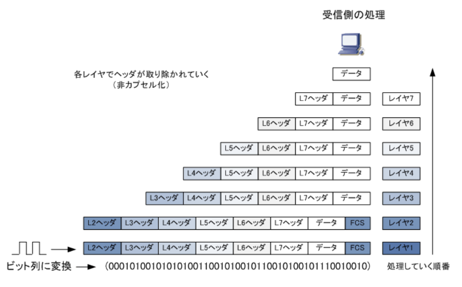
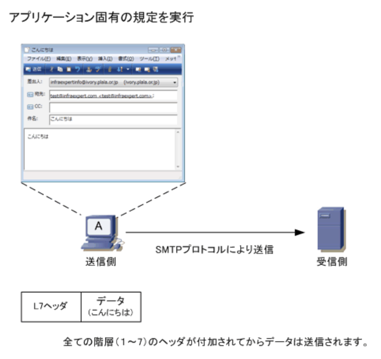

### ネットワークとは

- スタンドアロンからネットワークへ  
コンピュータが誕生した頃、コンピュータは単体で他のコンピュータと接続しない形態で利用していた。この利用形態を`スタンドアローン`と言う。コンピュータの進化につれて、コンピュータは相互に接続し利用されるようになる。複数台のコンピュータをケーブルや電波などで相互に接続して、相互に情報をやりとりする仕組みを`コンピュータネットワーク`と呼び、単にネットワークとも呼ぶ

- コンピュータネットワーク  
パソコンをネットワークに接続することにより、複数のPCがプリンタの利用を共有することができるため、`ハードウェアリソースの共有`が可能。また、サーバにあるファイルデータを複数のPCで共有できたり、一元管理することができる。`ソフトウェアリソースの共有`をすることができる。  
さらに、地理的に離れていてもネットワーク接続することで、例えば大阪支店のPCが東京本社のサーバのデータにアクセスすることができる。インターネット接続できればWebサイトにアクセスして幅広い情報を収集したり、メールソフトにより世界中の人とメールの送受信が可能となる

- コンピュータネットワークの分類  
規模に応じてLAN・WAN・インターネットに大きく分離できる。  
`LAN`(*Local Area Network*)は、同じ建物の中にあるコンピュータ、プリンタ、サーバなどを接続してデータをやり取りするネットワークのこと。家庭内で数台のPCを相互接続しているLAN(家庭内LAN)、企業内で数百台のPCなどを相互接続しているLAN(企業内LAN)などがある  
`WAN`(*Wide Area Network*)は、地理的に離れた場所にあるコンピュータなど相互接続して、データをやり取りするネットワークのこと。NTT、KDDI、ソフトバンクといった通信事業者が提供するサービス(広域イーサネット、IP-VPNなど)を利用する。WANによって、本社と支店の企業内LANを相互接続したり、異なる場所にある大学のキャンパスLANを相互接続したりすることが可能となる  
`インターネット`は、世界の全てのネットワークを相互接続した巨大なコンピュータネットワークのこと。家庭内LAN、大学キャンパスLAN、企業内LANなど、世界中の様々なネットワークが接続されている。インターネットは全体を統括するコンピュータは存在せず、全世界に分散された無数のコンピュータが、少しずつサービスを提供することで成り立っていり。Webサイトもインターネットの一部で、PCだけではなく、スマホなどの様々なメディアからアクセスできる

`イントラネット`は、このインターネット標準技術を用いて構築された企業内ネットワークのこと。インターネット標準技術とは、プロトコルにTCP / IPを利用した電子メールのシステム、Webのシステムなどのこと。イントラ(内部的な)ネットでは特定の組織内メンバーだけが閲覧できるWebサーバがあったり、特定の組織内のメンバーだけでメールの送受信ができるなど閉じたネットワークのこと。イントラネットが外部接続(インターネット接続)する場合、ファイアウォール等をその間に設置する

### ネットワークトポロジとは

- ネットワークトポロジ  
コンピュータネットワークの接続形態のこと。ネットワークにおいてPC、サーバ、スイッチ等の機器(ノード)がどのような形で接続するのかを表す。トポロジには、物理トポロジと論理トポロジがある。`物理トポロジ`は、実際にLANケーブルやPCがどのように接続するのかを示す物理的な構成のこと。`論理トポロジ`は、データの流れ方を表す論理的な構成のこと。代表的なネットワークトポロジにバス型、スター型、リング型、フルメッシュ型がある

- バス型トポロジ  
1本のケーブル(同軸ケーブル)に複数のノードを接続しているトポロジ。1本の同軸ケーブルの両端にターミネータと呼ばれる抵抗器を取り付け、終端での信号の反射・乱れを防ぐ。中心となる同軸ケーブルに障害が発生するとそれに接続する全てのノードが通信できなくなる。10Base2 / 10Base5など大昔のLAN規格で使用する物理トポロジ

- スター型トポロジ  
1つの集線装置(ハブやスイッチ)に複数のノードを接続しているトポロジのこと。1本のケーブルに障害が発生した場合でも他のノード通信に影響は出ないが、集線装置に障害が発生すると全てのノードの通信に影響が発生する。今日のLANの主流のトポロジ。スター型トポロジのハブに、別のハブを接続するような構成は拡張スター型トポロジと呼ぶ

- リング型トポロジ  
トークンリングLANにおける`論理トポロジ`が代表例。ノードは論理的にリング状に接続され、トークンと呼ばれるデータがリング状を高速に巡回している。このトークンを得たノードがデータを送信する事ができる。シングルリング型トポロジではどこか一箇所でも障害が発生すると全体が通信できなくなる。現在では見ることのない過去のトポロジ。  
耐障害性を強めたトポロジがデュアルリング型トポロジ。このトポロジではもう1つの予備のリングを設けることにより、プライマリリングに障害が発生した場合でも通信を継続できる仕組みになっている。FDDI LANの論理トポロジが代表例。トークンリングLANと同様FDDI LANは現在ではほぼ使用されていないのでシングルリング、デュアルリングともに、見ることがないトポロジ

|IEEE|トークンバッシング|使用するケーブル|論理トポロジ|物理トポロジ|
|-|-|-|-|-|
|802.4(解散)|トークンバス|同軸ケーブル|リング型|バス型|
|802.5|トークンリング|STPケーブル & MSAU|リング型|スター型|
| - |FDDI|光ファイバー & コンセントレータ|リング型|スター型|

- フルメッシュ型トポロジ  
特にルータなどのネットワーク機器における物理または論理トポロジが代表例。全てのルータと相互接続しており、特定のルータとのリンクに障害が発生した場合でも、他のルータとのリンクを介して、継続して通信できる。  
耐障害性に優れるが、物理トポロジでフルメッシュにするとコストがかかる。そこで、中心となるセンター側のルータや、一部のルータだけをメッシュ型にするパーシャルメッシュにすれば、コストを抑えられて、ある程度の冗長性と耐障害性を維持することができる

### プロトコルとは

- プロトコルとは  
コンピュータなどの機器同士で通信を行うために取り決められた約束ごと。約束ごとは「コンピュータ間でどのようにデータを送るのか、どれだけのデータを送るのか」ということ。コンピュータ間をただLANケーブルなどで物理的に接続しただけでは、相互に通信することができないが、このプロトコル(IPやTCP等)を使用することで、コンピュータとコンピュータを通信できる

- プロトコルスタックとは  
コンピュータ間の通信において使用されるプロトコルは1つではなく、役割の異なる複数のプロトコルを使用している。Webサイトを閲覧するためには、IP、TCP、HTTPなどのプロトコルを使用している。Webブラウザを使用してWebサイトの画面を見るためにHTTPが使用されているが、その下の階層ではTCP、さらにその下の階層ではIPが使用されている。このように、`通信に必要な複数のプロトコルを、階層構造で構成するプロトコル群のこと`をプロトコルスタックと呼ぶ

- プロトコルの種類  
プロトコルにはかず多くの種類、体系がある。現在最も主流な通信プロトコルといえば`TCP / IP`で、TCP / IPはLAN・WAN・インターネットなどで最も使用されているプロトコルです。TCP / IPといっても、通信する際にTCPとIPだけを使用する訳ではない。その他にUDP・FTP・Telnetなどの数多くのプロトコルを使用するが、それらを総称してTCP / IPと呼ぶ

|通信プロトコルの体系|使用されるプロトコルの例|主な用途|
|----------------|--------------------|-------|
|TCP / IP|IP, ICMP, TCP, UDP, SMTP, HTTP等|全てのネットワーク|
|IPX / SPX|IPX, SPX, NCP等|Netware OS環境のLAN|
|AppleTalk|AARP, DDP, RTMP, AEP等|Mac OS環境のLAN|

- コンピュータ間で通信を実現する  
コンピュータ同士が通信するためには、同じ体系の通信プロトコルを使用する必要がる。コンピュータAがTCP / IP対応の通信プロトコルを使用しているならコンピュータBもTCP / IPプロトコルを使用していないとプロトコルが異なるので相互に通信できない

### OSI参照モデル1

- OSI(*Open Systems Interconnection*)参照モデル  
国際標準化機構（ISO）により策定されたコンピュータなどの通信機器の通信機能を、階層構造に分割したモデル。このOSI参照モデルでは通信プロトコルを7階層に分けて、`それぞれの階層で行われる通信機能を定義`している。OSI参照モデルにより、ネットワーク全体でどのようにデータが伝送されていくのか、ネットワークの仕組みを分かりやすく理解できるように促進している側面もある。  
ネットワークエンジニアが設計・構築・障害対応などでプロトコルに関して議論する場合は、OSI参照モデルに基づき話をすることが一般的。`異種種間の通信を実現するため`の設計方針(OSI)として1984年に策定された

- OSI参照モデルの階層構造  
第1層から第7層まである。各階層は一般的に数値では呼ばれない

|各層(数値)   |名称             |
|------------|----------------|
|第7層(レイヤ7)|アプリケーション層 |
|第6層(レイヤ6)|プレゼンテーション層|
|第5層(レイヤ5)|セッション層      |
|第4層(レイヤ4)|トランスポート層   |
|第3層(レイヤ3)|ネットワーク層     |
|第2層(レイヤ2)|データリンク層     |
|第1層(レイヤ1)|物理層            |

- OSI参照モデルにおけるカプセル化・非カプセル化  
コンピュータ間で通信する場合、送信側ではレイヤ７, 6, 5, 4, 3, 2, 1の順番に処理を行う。各層の規定通りに順番に処理されると、その処理した情報は`ヘッダ`としてデータの前に付加されていく。このように上位層の処理情報をヘッダとして下位層で包み込んでいくことを`カプセル化`と呼ぶ。そしてレイヤ7から順番に処理されていくと、レイヤ1の処理でデータが最終的に電気信号となって送信される。レイヤ2ヘッダでは受信したフレームに誤りがないかどうかを調べるための`FCSヘッダ`も付加される

一方、受信側のコンピュータでは受信した電気信号をレイヤ1, 2, 3, 4, 5, 6, 7の順で処理していく。レイヤ1では電気信号をビット列に変換してコンピュータ上に取り込んでいき、レイヤ2ではL2ヘッダの情報に基づいて処理した上でL2ヘッダを取り外す。レイヤ3以降も同様に、ヘッダ情報に基づいて処理した上でヘッダを取り外し、最終的には受信側のコンピュータのアプリケーション上でもとのデータを受け取れる。下位層から上位層にいくにつれて各層のヘッダを取り外していくことを`非カプセル化`と呼ぶ

- PDU(プロトコルデータユニット)  
コンピュータ間の通信において使用されるデータの単位のこと。レイヤ2ではデータの単位を`フレーム`、レイヤ3ではデータの単位を`パケット`、レイヤ4ではデータの単位を`セグメント`と呼ぶ。レイヤ2の機器のスイッチなどではフレーム転送、レイヤ3の機器のルータなどではパケット転送等と言われる。一般的には、コンピュータのデータの単位は「パケット」と呼ぶ人が多い。パケットやフレームなどのヘッダを取り除いたデータ部分だけのことは`ペイロード`と呼ばれている

|レイヤ|PDU|
|-----|---|
|レイヤ1(物理層)|ビット|
|レイヤ2(データリンク層)|フレーム|
|レイヤ3(ネットワーク層)|パケット|
|レイヤ4(トランスポート層)|セグメント(データグラム)|

### OSI参照モデル2

- アプリケーション層(レイヤ7)  
利用するアプリケーションの通信サービスが実現できるよう`固有の規定を定義`している。そのため、Webページを閲覧するブラウザ、電子メールを送受信するメーラなどこれらのアプリケーションごとにプロトコルがある。例えばWebページの閲覧なら`HTTP`、電子メールの送受信なら`SMTP`と`POP3`というプロトコルを使用する。この層は、ユーザが直接に接する部分の層。  
パソコンAがメールサーバにメールを送信する場合、メーラーの送信ボタンをクリックすると指定したメールアドレス宛に送信するための処理がコンピュータ上にて開始されるが、この処理がアプリケーション層の部分。結果メッセージと一緒にアプリケーション層で処理された内容がヘッダとして付加されて下位の階層(プレゼンテーション層)にデータが渡される

- プレゼンテーション層(レイヤ6)  
圧縮方式、文字コード、データの暗号 / 復号などの`データの表現形式の規定`を定義している。この層により送信側と受信側のコンピュータで使用している表現形式は異なっていても、送信側のコンピュータで「コンピュータ固有の表現形式」から「標準的な表現形式」に変換して送信して、受信側で「コンピュータ固有の表現形式」に変換し直すことで、文字化けなしに送受信できる。  
「文字コード」の表現形式を考えてみる。Windows7で日本語の文字コードとして「Shift JIS」を使用しているとする。一方、UNIXサーバでは文字コードとして「EUC」を使用しているとする。この2つのPCが、プログラム間でデータの表現形式を何も変換しないと文字化けが発生してしまうが送信側コンピュータで、「標準的な形式(文字コード)」に変換してから送信すれば問題は発生しない

- セッション層(レイヤ5)  
アプリケーション間での`セッションの確立・維持・終了`するまでの手順を規定している。1つのコンピュータ上でWebブラウザとメーラーを起動させて通信しているとする。セッション層で、Webブラウザで送受信しているデータをメーラで送受信しないように、各アプリケーション同士の論理的な経路(セッション)を制御している。セッションが確立するとデータ転送が可能な状態になる

- トランスポート層(レイヤ4)  
ノード間のデータ伝送における`信頼性の提供`と、アプリケーション間でセッションを開始する上で`必要なポート番号の割当`について規定している。データ伝送における信頼性を確保するために、ノード間においては`コネクションの確立・エラー制御・フロー制御・順序制御`などを行っている。  
アプリケーション同士の論理的な経路を`セッション`と言い、ノード間における論理的な経路は`コネクション`と呼ぶ。コネクションはセッション上でデータ転送を行うための論理的な経路。このコネクションは、例えばTCPコネクションのことを指す。トランスポート層のプロトコルはデータ伝送における信頼性を保証するための機能を提供しているがTCPを使用する場合で、UDPを使用する通信では信頼性はない  
・`セッション` : 通信の開始から終了までを管理する1つの単位のこと。端末の間でセッションが確立すると、通信で使用するアプリケーションがデータ転送可能な状態になる  
・`コネクション` : セッションでデータ転送を行うための論理的な回線のこと。一般的にトランスポート層のTCPコネクションを指す

- ネットワーク層(レイヤ3)  
ノード間での`エンドツーエンド(起点から終点)の通信を規定`する。送信元のコンピュータからのデータをスイッチ・ルータ等の機器を経由して、宛先のコンピュータへ届けるためにソフトウェアアドレス(例 : IPアドレス)をノードに割り当て、ルータはこのソフトウェアアドレスに基づき、宛先のコンピュータまでの最適なパスを選択してデータを送信する  
`ルーティング` : 宛先のコンピュータまでパケットを送信する時に、最適な経路を選択してパケット送信すること

- データリンク層(レイヤ2)  
1つのネットワーク回線上で`直接接続されたノード同士の通信`について規定している。LANではEthernetなどにより同じネットワークセグメント内におけるノード間の通信を行っており、WANでは、PPPやHDLCで隣接するネットワーク機器間の通信を行っている。  
LANで各ノードにハードウェアアドレス(MACアドレス等)を割り当て、その情報をもとに通信を行う。また、`FCS`を付加することで受信フレームにエラーがないかどうかを検出できる

- 物理層(レイヤ1)  
`PHY`とも呼ばれる。`ネットワークの物理的な接続や伝送方式`を規定している。ノードからのデータを送信する場合はコンピュータ内部で使用している「0」と「1」のビット列を電気信号に変換しネットワークへ伝送を行う。ノードがネットワークから信号を電気受信する場合は、受信した信号をノードが理解できるように信号を「0」と「1」のビット列に変換して、コンピュータ内部に情報を取り込む

### ユニキャスト / マルチキャスト / ブロードキャストの違い

- ユニキャスト・マルチキャスト・ブロードキャスト

|通信方式|説明|
|------|----|
|ユニキャスト|単一のアドレスを指定して`1対1`で行われるデータ通信|
|マルチキャスト|特定のアドレスを指定して`1対複数`で行われるデータ通信|
|ブロードキャスト|同じデータリンク内の全宛先を指定し、`1対不特定多数`で行われるデータ通信|

- ユニキャスト・マルチキャスト・ブロードキャストの用途

ユニキャスト通信は、通信相手先を指定して`1対1で通信`をする、最も標準的な通信。PCとWebサーバをユニキャスト通信することでWebサイトを閲覧している。他にも電子メールの送受信など、色々な用途で最も使用されている通信方式

マルチキャストアドレスという特殊なアドレス(224.0.0.0 ~ 239.255.255.255 : クラスD)を使用して、`特定のグループに所属する全てのPCにデータを送る`通信方式。ネットワーク上の動画配信などでよく使用される。送信元のコンピュータが送信する1つのパケットをマルチキャスト対応ルータなどで複製し、同時に宛先の数だけそのパケットを送信する。ユニキャストであると通信したい宛先に1つずつパケットを送出する必要があり、動画や音楽などを容量の大きいデータを多数の宛先に送信するためには非常に負荷がかかるので効率的

ブロードキャストアドレスというアドレスを使用して`同一LANの全てのノードにデータを送る`通信方式。`IPアドレスからMACアドレスの情報を求めるARP`で利用したり、IPアドレス取得のためDHCPで利用したり`ルーティング情報のアップデート`で使用する。ブロードキャスト通信は、ユニキャスト通信を実現する上で最初に行われる大切な通信であるとも言える。  
ブロードキャストアドレスは`ホスト部が255`となる。「192.168.1.0 / 24」のネットワークでは「192.168.1.255」がブロードキャストアドレスとなる。DHCPでIPアドレスを取得する際にLANで使用されるブロードキャストアドレスは、255.255.255.255(リミテッドブロードキャストアドレス)。ブロードキャスト通信は同一のLANでだけ配信されるので、ルータ等のL3機器を超えることはできない

### ネットワークストレージとは

- ストレージとは  
デジタル情報を記憶・保存する装置のことで、ハードディスク・MO・CD-R・磁気テープなどが該当する。ストレージの接続形態にはDAS、NAS、SANの大きく3種類。ストレージをサーバなどに直接接続する形態は`DAS`(*Direct Attached Storage*)、ストレージをネットワーク上に接続する形態には`NAS`(*Network Attached Storage*)と`SAN`(*Storage Area Network*)の2種類がある。NASやSANの接続形態によって利用するストレージのことを`ネットワークストレージ`と呼ぶ

- DAS(*Direct Attached Storage*)  
1台のサーバなどに直接接続する形態のこと、またはサーバに直接接続するストレージそのもの。ストレージの接続には`ATA`、`SATA`、`SCSI`、`SAS`がプロトコルとして用いられる。DASの構成では、接続に専門の知識が必要なく増設も容易だが、複数のサーバでストレージを共有することが出来ず、余っているストレージの領域を別のサーバで利用できないデメリットがある

- NAS(*Network Attached Storage*)  
ネットワークを介して接続する形態のこと。またはネットワークを介し利用するストレージそのもの(ネットワークストレージ)。NASは「ハードディスク・LANインターフェース・簡易OS」などで構成されるファイルサーバ専用機と言える。NASは、LAN接続型ハードディスクとも呼ばれる。NASは、Windows・MAC・Linuxなどの各OSのファイル共有プロトコルをサポートしている。NASは外付け型のHDDとは異なる。外付け型HDDの場合、LANではなくUSBやIEEE 1394経由でデータをやり取りする

- SAN(*Storage Area Network*)  
ストレージとサーバ間をFC(ファイバチャネル)で接続したストレージ専用のネットワークのこと。ファイバチャネルは、サーバなどのコンピュータと周辺機器を接続し、高速伝送を可能にする方式のこと。ファイバチャネルに光ファイバーを使用して、LANとは独立した`ストレージ専用のネットワーク`を構築する。  
NASでは、CIFS、NFS、AFP等のファイル共有プロトコルは問題なく使用できるが、一部のDBのアプリケーションには適していない。一方、SANでは幅広いアプリケーションに対応している。SANではDASやNASに比べて導入コストが高いこと、導入に際して高度な専門知識が必要となるデメリットがある。NASではファイルシステムを介しストレージ装置を利用する。SANではハードディスク等のストレージ装置そのものを共有する

