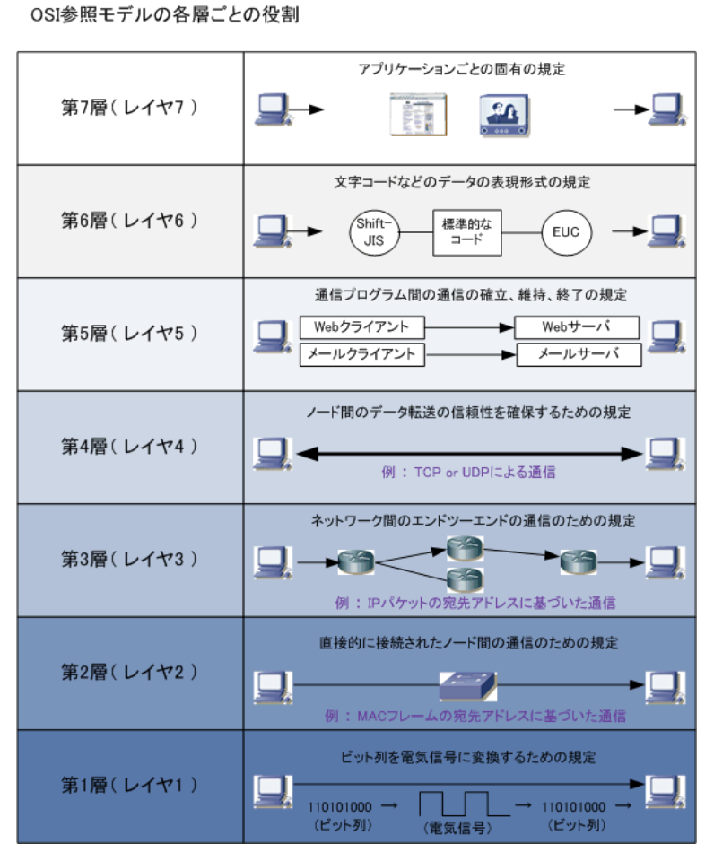
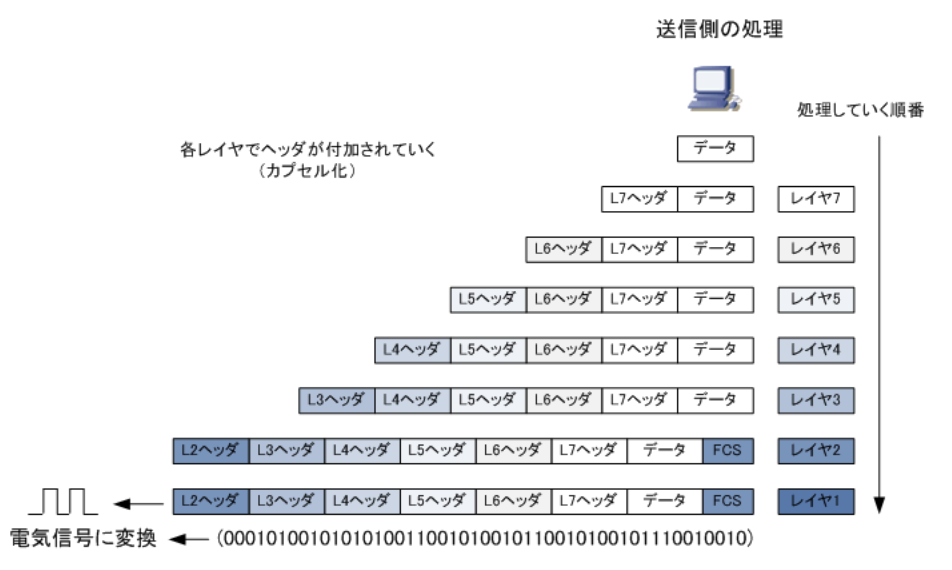

- OSI(*Open Systems Interconnection*)参照モデル  
国際標準化機構（ISO）により策定されたコンピュータなどの通信機器の通信機能を、階層構造に分割したモデル。このOSI参照モデルでは通信プロトコルを7階層に分けて、`それぞれの階層で行われる通信機能を定義`している。OSI参照モデルにより、ネットワーク全体でどのようにデータが伝送されていくのか、ネットワークの仕組みを分かりやすく理解できるように促進している側面もある。  
ネットワークエンジニアが設計・構築・障害対応などでプロトコルに関して議論する場合は、OSI参照モデルに基づき話をすることが一般的。`異種種間の通信を実現するため`の設計方針(OSI)として1984年に策定された

- OSI参照モデルの階層構造  
第1層から第7層まである。各階層は一般的に数値では呼ばれない

|各層(数値)   |名称             |
|------------|----------------|
|第7層(レイヤ7)|アプリケーション層 |
|第6層(レイヤ6)|プレゼンテーション層|
|第5層(レイヤ5)|セッション層      |
|第4層(レイヤ4)|トランスポート層   |
|第3層(レイヤ3)|ネットワーク層     |
|第2層(レイヤ2)|データリンク層     |
|第1層(レイヤ1)|物理層            |

- OSI参照モデルにおけるカプセル化・非カプセル化  
コンピュータ間で通信する場合、送信側ではレイヤ７, 6, 5, 4, 3, 2, 1の順番に処理を行う。各層の規定通りに順番に処理されると、その処理した情報は`ヘッダ`としてデータの前に付加されていく。このように上位層の処理情報をヘッダとして下位層で包み込んでいくことを`カプセル化`と呼ぶ。そしてレイヤ7から順番に処理されていくと、レイヤ1の処理でデータが最終的に電気信号となって送信される。レイヤ2ヘッダでは受信したフレームに誤りがないかどうかを調べるための`FCSヘッダ`も付加される  
  
一方、受信側のコンピュータでは受信した電気信号をレイヤ1, 2, 3, 4, 5, 6, 7の順で処理していく。レイヤ1では電気信号をビット列に変換してコンピュータ上に取り込んでいき、レイヤ2ではL2ヘッダの情報に基づいて処理した上でL2ヘッダを取り外す。レイヤ3以降も同様に、ヘッダ情報に基づいて処理した上でヘッダを取り外し、最終的には受信側のコンピュータのアプリケーション上でもとのデータを受け取れる。下位層から上位層にいくにつれて各層のヘッダを取り外していくことを`非カプセル化`と呼ぶ  

- PDU(プロトコルデータユニット)  
コンピュータ間の通信において使用されるデータの単位のこと。レイヤ2ではデータの単位を`フレーム`、レイヤ3ではデータの単位を`パケット`、レイヤ4ではデータの単位を`セグメント`と呼ぶ。レイヤ2の機器のスイッチなどではフレーム転送、レイヤ3の機器のルータなどではパケット転送等と言われる。一般的には、コンピュータのデータの単位は「パケット」と呼ぶ人が多い。パケットやフレームなどのヘッダを取り除いたデータ部分だけのことは`ペイロード`と呼ばれている

|レイヤ|PDU|
|-----|---|
|レイヤ1(物理層)|ビット|
|レイヤ2(データリンク層)|フレーム|
|レイヤ3(ネットワーク層)|パケット|
|レイヤ4(トランスポート層)|セグメント(データグラム)|
