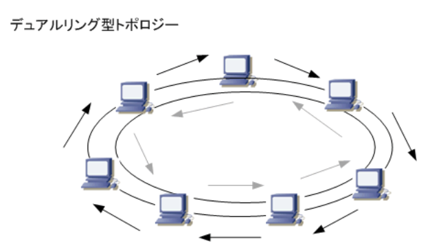
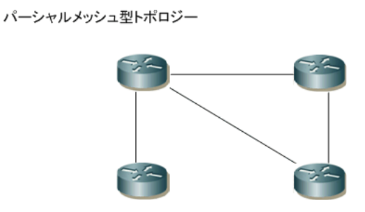

- ネットワークトポロジ  
コンピュータネットワークの接続形態のこと。ネットワークにおいてPC、サーバ、スイッチ等の機器(ノード)がどのような形で接続するのかを表す。トポロジには、物理トポロジと論理トポロジがある。`物理トポロジ`は、実際にLANケーブルやPCがどのように接続するのかを示す物理的な構成のこと。`論理トポロジ`は、データの流れ方を表す論理的な構成のこと。代表的なネットワークトポロジにバス型、スター型、リング型、フルメッシュ型がある

- バス型トポロジ  
1本のケーブル(同軸ケーブル)に複数のノードを接続しているトポロジ。1本の同軸ケーブルの両端にターミネータと呼ばれる抵抗器を取り付け、終端での信号の反射・乱れを防ぐ。中心となる同軸ケーブルに障害が発生するとそれに接続する全てのノードが通信できなくなる。10Base2 / 10Base5など大昔のLAN規格で使用する物理トポロジ

- スター型トポロジ  
1つの集線装置(ハブやスイッチ)に複数のノードを接続しているトポロジのこと。1本のケーブルに障害が発生した場合でも他のノード通信に影響は出ないが、集線装置に障害が発生すると全てのノードの通信に影響が発生する。今日のLANの主流のトポロジ。スター型トポロジのハブに、別のハブを接続するような構成は拡張スター型トポロジと呼ぶ

- リング型トポロジ  
トークンリングLANにおける`論理トポロジ`が代表例。ノードは論理的にリング状に接続され、トークンと呼ばれるデータがリング状を高速に巡回している。このトークンを得たノードがデータを送信する事ができる。シングルリング型トポロジではどこか一箇所でも障害が発生すると全体が通信できなくなる。現在では見ることのない過去のトポロジ。  
耐障害性を強めたトポロジがデュアルリング型トポロジ。このトポロジではもう1つの予備のリングを設けることにより、プライマリリングに障害が発生した場合でも通信を継続できる仕組みになっている。FDDI LANの論理トポロジが代表例。トークンリングLANと同様FDDI LANは現在ではほぼ使用されていないのでシングルリング、デュアルリングともに、見ることがないトポロジ

|IEEE|トークンバッシング|使用するケーブル|論理トポロジ|物理トポロジ|
|-|-|-|-|-|
|802.4(解散)|トークンバス|同軸ケーブル|リング型|バス型|
|802.5|トークンリング|STPケーブル & MSAU|リング型|スター型|
| - |FDDI|光ファイバー & コンセントレータ|リング型|スター型|

- フルメッシュ型トポロジ  
特にルータなどのネットワーク機器における物理または論理トポロジが代表例。全てのルータと相互接続しており、特定のルータとのリンクに障害が発生した場合でも、他のルータとのリンクを介して、継続して通信できる。  
耐障害性に優れるが、物理トポロジでフルメッシュにするとコストがかかる。そこで、中心となるセンター側のルータや、一部のルータだけをメッシュ型にするパーシャルメッシュにすれば、コストを抑えられて、ある程度の冗長性と耐障害性を維持することができる

