### TCP / IPの階層モデル

- TCP / IP(*Transmission Control Protocol / Internet Protocol*)とは

現在のインターネット通信およびイントラネット通信において最も利用されている通信プロトコル。TCP / IPは複数のプロトコルからなるが、中心的な役割を果たすのがTCPとIPであることからTCP / IPと呼ばれるようになった

- TCP / IPの階層モデル

TCP / IPにおける階層モデルは4階層から構成されている。アプリケーション層・トランスポート層・インターネット層・ネットワークインターフェース層の4つ。ネットワークインターフェース層は単にネットワークアクセス層とも呼ばれている

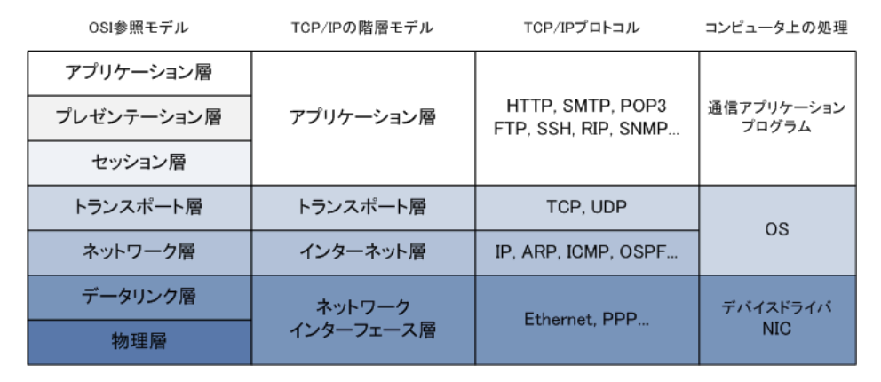

- 各階層における役割

・アプリケーション層(TCP / IPプロトコルスタック)  
主に`アプリケーションごとの固有`の規定。HTTP・FTP・SMTP・SSHなどの`アプリケーション層のプロトコル`により、通信アプリケーションの機能が実現される  
・トランスポート層  
主に`ノード間のデータ転送の信頼性を確保する`ための規定。`TCPまたはUDPのプロトコル`を使用する。TCPを使用する場合は信頼性の高い通信を実現し、UDPを使用する場合は信頼性ではなく効率重視のデータ転送を実現することになる  
・インターネット層  
主に`ネットワーク間のエンドツーエンドの通信`のための規定。IPが代表的なプロトコル。IPにより、ネットワーク上のノードに対し自分の位置情報となる論理アドレス(IPアドレス)を割り当てられるのでエンドツーエンドの通信を実現する  
・ネットワークインターフェイス層  
主に`直接的に接続されたノード間の通信`のための規定。LANプロトコルはイーサネット、WANプロトコルはPPPが代表的なプロトコル。イーサネットでは、セグメント上のノードに対して、自分の位置情報となる物理アドレス(MACアドレス)を割り当てることができ、ローカルでのノード間の通信が実現することになる

- TCP / IPの階層モデルにおけるカプセル化・非カプセル化

コンピュータ間で通信する場合、送信側のコンピュータではアプリケーション層、トランスポート層、インターネット層、ネットワークインターフェース層、通信ケーブルの順番でカプセル化を行いデータが送出され、受信側では反対の順番で非カプセル化を行って送信側で付加したヘッダを取り除いていく。考え方はOSI参照モデルと同様。  
イーサネットLANにあるコンピュータがWebサイトを参照するためには、アプリケーション層ではHTTPプロトコル、トランスポート層ではTCPプロトコル、インターネット層ではIPプロトコル、ネットワークインターフェース層ではEthernetプロトコルを使用し、送信側では各層で処理されるたびに、これらのプロトコルのヘッダが付加されて送信されて、受信側では各階層でそのヘッダを取り除いている

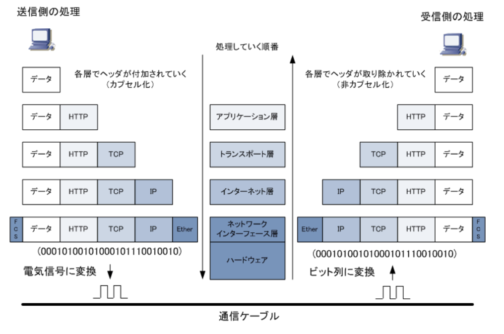

### IP

- IP(*Internet Protocol*)とは

OSI参照モデルでは`ネットワーク層`で動作し、TCP / IP階層モデルでは`インターネット層`で動作するプロトコル。IPは論理アドレス(IPアドレス)を各ノードに割り当てることで、各ノードを識別することができる。このIPアドレスの宛先を確認することで、あるノードから別のノードへデータを送信することができる。IPアドレスの宛先情報については`IPヘッダ`に含まれている

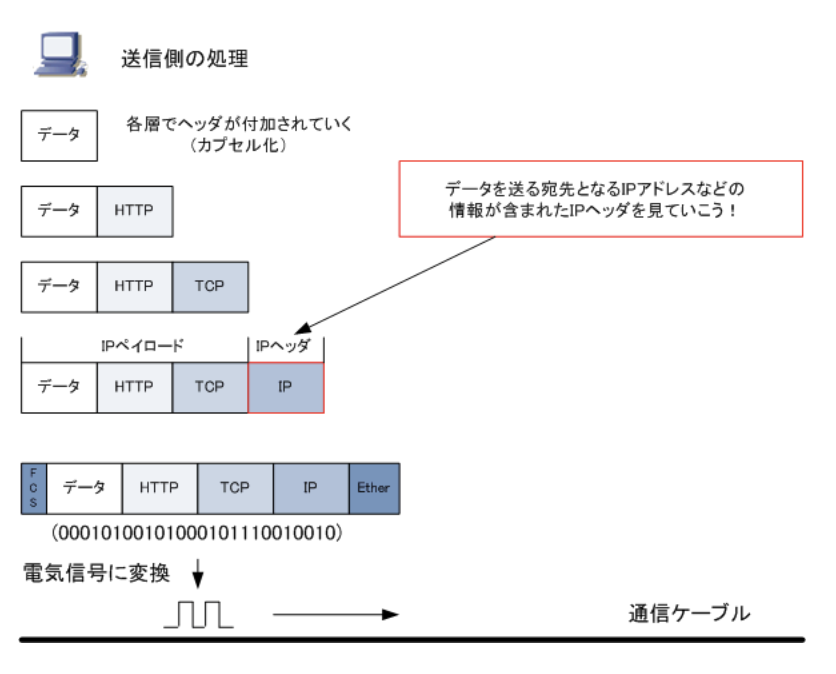

- IPヘッダのフォーマット

サイズは20バイトだが、オプションが追加された場合は最大で60バイトとなる(一般的には使用されない)。データはIPヘッダではなくIPペイロードと呼ばれる部分

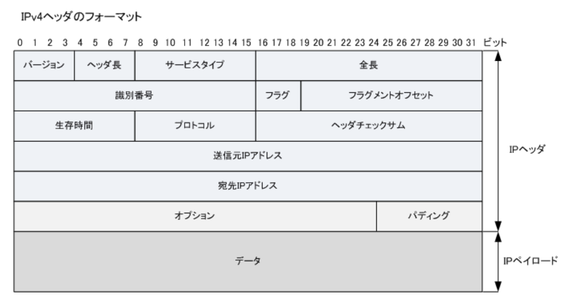

`バージョン`(4bit)  
IPヘッダのバージョン番号の情報  
`ヘッダ長`(4bit)  
IPヘッダの長さの情報。単位は32ビットであることからオプションを使用しない  
`サービスタイプ`(8bit)  
IPパケットの優先順位の情報。音声トラフィックとデータトラフィックとでは、音声トラフィックのデータを優先して送出することができる。QoS処理用  
`全長`(16bit)  
IPヘッダを含むパケットの全長(パケット長)  
`識別番号`(16bit)  
`個々のパケットを識別する`ための情報。パケットが分割された時に分割されたパケットには同じ識別番号にすることで、受信側で複数の分割されたパケットを受信した場合においても、この識別番号に基づき正しく組み立て処理できる  
`フラグ`(3bit)  
パケット分割における制御の情報  
`フラグメントオフセット`(13bit)  
フラグメントされたパケットが元のパケットのどの位置であったか示す情報  
`生存時間`(8bit)  
パケットの生存時間を示す情報。実際には、何台のルータ or L3スイッチを通過することができるかという情報。1台のルータを通過するごとにTTL値は1ずつ減らされて、TTL値が0になると、パケットは破棄される  
`プロトコル`(8bit)  
上位層(トランスポート層)のプロトコルを示す情報。ICANNによりプロトコル名と番号が定義されている。上位層プロトコルにTCPを使用する場合、このプロトコル番号は6となる  
`ヘッダチェックサム`(16bit)  
IPヘッダのチェックサムを表す情報。IPヘッダにエラーがないかチェックする  
`送信元IPアドレス`(32bit)  
32ビット(4byte)で構成された、送信元のIPアドレスの情報  
`宛先IPアドレス`(32bit)  
32ビット(4byte)で構成された、宛先のIPアドレスの情報  
`オプション`(可変長)  
通常使用されない。デバッグやテストに使用される情報  
`パディング`(可変長)  
通常使用されない。上記のオプションを使用した場合にはIPヘッダ長が32ビットの整数倍にならない場合がある。32ビットの整数倍にするために詰め物(*Padding*)として空データの0を入れることにより調整する

IPヘッダのフィールドにあるフラグ値には、以下の3ビットの組み合わせが値として入る。  
先頭ビットの0ビット目は未使用で、必ず値が0である必要がある。  
次に中央ビットの1ビット目は`パケットの分割(フラグメント)を許可する`場合は値を0にして、フラグメントを許可しない場合は1にする。  
最終ビットの2ビット目はパケットがフラグメントされた場合に使用される。`分割された最後のパケットである場合`は値を0、そうでなければ1にする  
IPヘッダのフィールドにあるプロトコルの値には以下のようなプロトコル番号が値として入ることになる。ICMPやOSPF等はIPと同じインターネット層のプロトコルだが、これらのプロトコルはIPヘッダが付加されIPパケットとして転送されることから上位層プロトコルの番号がある

|プロトコル番号|名称|
|-----------|----|
|1|ICMP(*Internet Control Message Protocol*)|
|6|TCP(*Transmission Control Protocol*)|
|17|UDP(*User Datagram Protocol*)|
|88|EIGRP(*Enhanced Interior Gateway Routing Protocol*)|
|89|OSPF(*Open Shortest Path First*)|

- IPプロトコルの特徴

3つの特徴がある。IPプロトコル自体には信頼性のあるものではない。信頼性のある通信にするかどうかは上位層に任せている。TCPを使用すれば信頼性の高いTCP / IPの通信となる。UDPを使用した場合は、信頼性のある通信にはならないが、効率性の高いUDP / IPの通信となる。  
`コネクションレス型通信`  
ネットワーク通信に際して、事前にコンピュータ間でコネクションを確立せずにいきなりデータ伝送をはじめる通信のこと。上位層プロトコルにTCPを使用すれば、コンピュータ間の通信でみればコネクション型の通信となる  
`ベストエフォート型通信`  
ネットワーク通信に際して、最善の努力(ベストエフォート)は尽くすが、十分な品質は保証しない通信のこと。上位層プロトコルにTCPを使用することで、IPを使用した通信でもパケット損失がないように見せることができる  
`階層型アドレッシング`  
IPプロトコルにより割り当てられる論理アドレス(IPアドレス)は、コンピュータが所属しているグループ(ネットワーク部)と、そのネットワークに接続されているコンピュータを識別する番号(ホスト部)の2階層により構成されている

### ARP、RARPとは

- ARP(*Address Resolution Protocol*)とは

`IPアドレスからEthernetのMACアドレスの情報を得られる`プロトコル。LANに接続されたコンピュータ間で通信するためには、IPパケットは下位のレイヤでL2ヘッダが付加された上で伝送されることからMACアドレスの情報が必要となる。しかしこれらのIPアドレスとMACアドレスは自動的な関連付けがないので、ARPでMACアドレスを得る必要がある。TCP / IPを利用したコンピュータのLAN通信では、IPアドレスとMACアドレスが分かることで通信できる

- ARPの仕組み

`ARPリクエスト`と`ARPリプライ`という2種類のパケットがある。ARPはこれら2種類のパケットを利用し、宛先となるIPアドレスを持つノードのMACアドレスの情報を得る。下図においてコンピュータAがコンピュータBと通信したいとする。その場合、先ずコンピュータAからARPリクエストを同じセグメントの全ての端末に送信するためにARPリクエストをブロードキャストする

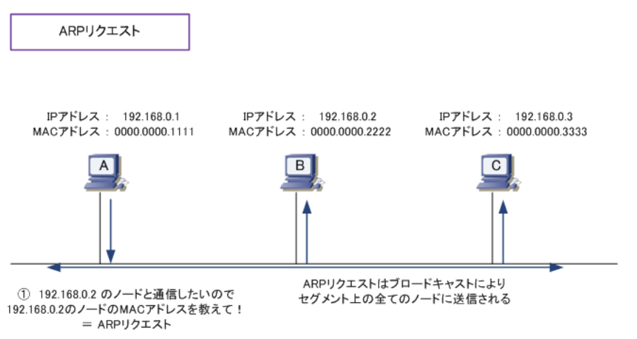

このARPリクエストのパケットの中には、`MACアドレスを知りたいノードのIPアドレス情報`が入っている。ARPリクエストはブロードキャストされるので、全ノードがこのパケットを受信するが、ARPパケットの中身を見て探索しているIPアドレスが自分（192.168.0.2）と分かったコンピュータBは、コンピュータBのMACアドレス情報をコンピュータAに伝えるために`ARPリプライのパケットをコンピュータAだけ`に送る。これでコンピュータAはBのMACアドレスを知ることができるので、LAN上での通信ができるようになる

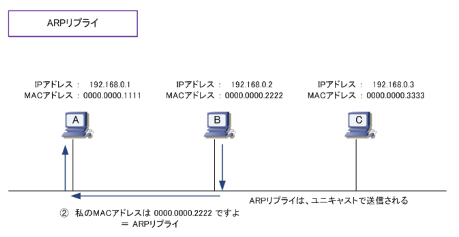

ここまでがARPの基本的な動作。コンピュータAが通信したい相手のコンピュータのIPアドレスが172.16.0.1だとする。その場合、172.16.0.1と通信したいので、172.16.0.1のMACアドレスを得るためのARPリクエストではなく、デフォルトゲートウェイのIPである192.168.0.254のMACアドレスを得るためのARPリクエストを送信する。一般的には、デフォルトゲートウェイのIP = ルータのIP

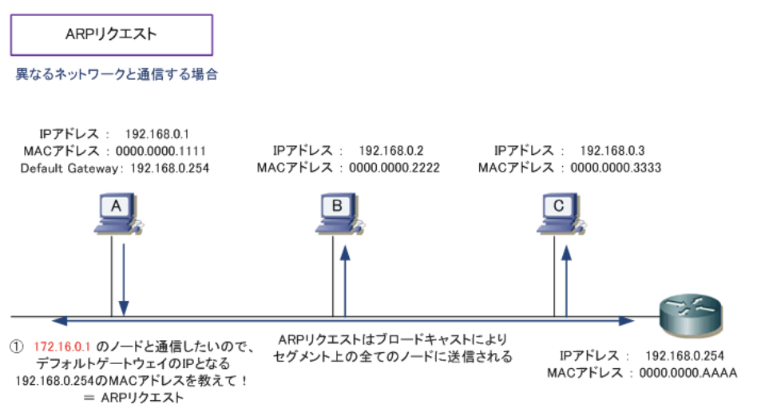

- RARP(*Reverse Address Resolution Protocol*)とは

`EthernetのMACアドレスからIPアドレスの情報を得る`ことのできるプロトコル。ARPとは逆の動きのこのプロトコルは、現在ほぼ使用されていない。IPアドレスを持たないと通信できない機器であるにも関わらず、IPアドレスの設定ができない(またはIPアドレスの設定が保存できない)機器がある場合に使用される。  
このような機器は起動時には自身のIPアドレスは分からないが、インターフェイスのハードウェア部分にMACアドレス情報としては保持していることから、RARPリクエストをすることで、RARPサーバからIPアドレスを取得できる

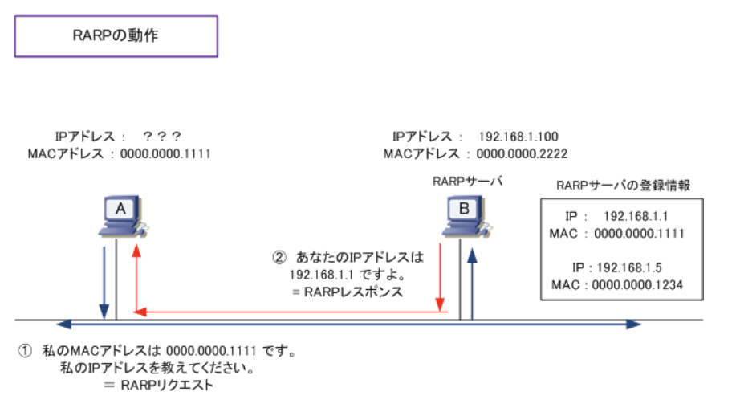

### GARPとは

- GARPとは

*Gratuitous ARP*はARPパケットの1つで、2つの役割を持っているプロトコル。  
・自身に設定する`IPアドレスが重複していないか検出する`  
・同一セグメントのネットワーク機器上のARPキャッシュを更新させる  
GARPは、自身に設定するIPアドレスに対するARPのこと。通常のARPでは宛先のIPアドレスに対して宛先のMACアドレスを得ようとするが、GARPでは自身のIPアドレスに対して自身のMACアドレスを得ようとする。上記の2つの役割を実現するため、自身のMACアドレスは知っていても自身のIPアドレスに対してARPを行う必要がある

- 役割1 : IPアドレスの重複を検出する

自身にIPアドレスがアサインされる際に他のホストが同じIPアドレスを使用していないかどうかを確認できる  
1.GARPによるARPリクエストを送信  
2.既にアドレスが使用されているため、伝えるためにGARPを送信したホストにARPリプライを送信  
3.GARPに対する送信があったため、IPアドレスの重複を検知

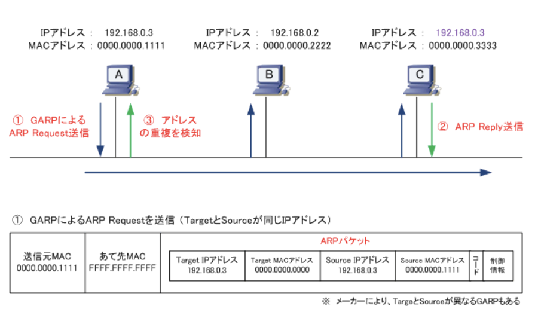

- 役割2 : ARPキャッシュの更新

同一セグメントのネットワーク機器上のARPキャッシュを更新することで、VRRPやHSRP(ルータ)などで切り替わりが発生した機器とすぐ通信できるようにするためにも使用される

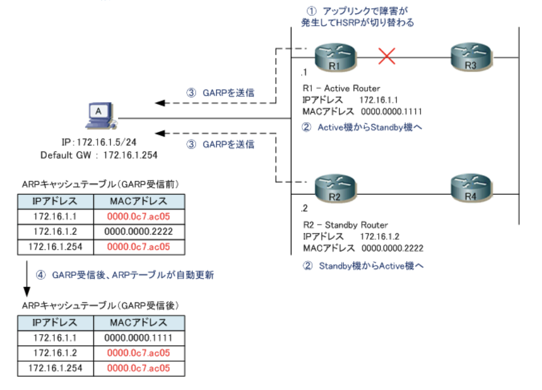

|    |説明|
|----|---|
|ARP |相手のIPアドレスからMACアドレスを得る|
|RARP|MACアドレスから自身のIPアドレスを得る|
|GARP|自身のIPアドレスが重複していないか検出する 同一セグメントのネットワーク機器上のARPキャッシュを更新させる|

### ARPキャッシュとARPテーブル

- ARPキャッシュとARPテーブル

1度、ARPリクエストとARPリプライによりARPの情報がやりとりされると`ARPキャッシュ`として一定時間情報が残る。その場合、ARPリクエストとARPリプライの通信をすることなくLANでの通信が可能。ARPのキャッシュ情報は、ARPテーブルに保存され、PCの場合は`arp -a`で情報を確認できる。削除したい場合は`arp -d`で削除できる。  
・`インターフェイス`  
自身のIPアドレス情報  
・`インターネットアドレス`  
通信の宛先となるIPアドレス情報  
・`物理アドレス`  
通信の宛先となるMACアドレス情報(ARPリクエストにより得られた情報)  
・`種類`  
arpが動的に学習された場合は`dynamic`、手動で登録した情報は`static`

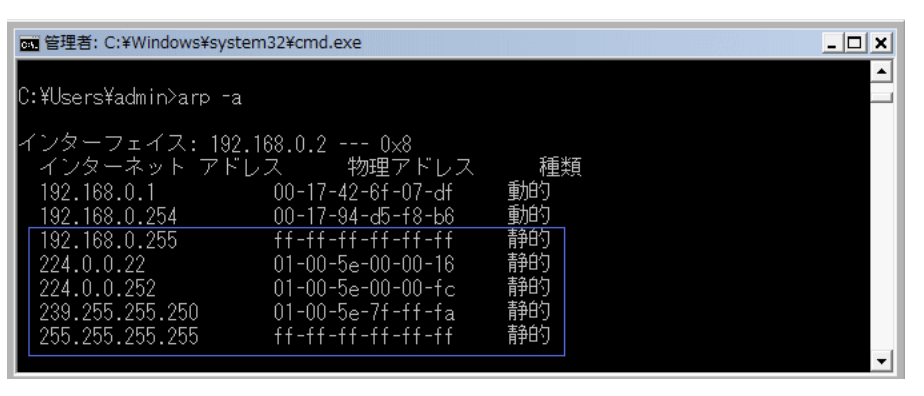

Cisco機器でARPテーブルを確認する場合は`show ip arp`を入力する。Ciscoルータでは自分自身のIPアドレスとMACアドレスの情報もARPテーブルにのせる。CiscoルータのインターフェイスのIPアドレスは192.168.0.254となるが、自身の情報はARPのキャッシュ時間の項目(Age)のところに`-`が表示される。このキャッシュは消えない。Cisco IOS SoftwareのARPエントリのタイムアウトはデフォルトで240分となっている

- ARPパケットのフォーマット

IPと同様にOSI参照モデルの`ネットワークで動作する`、IPパケットではなく`ARPパケット`である、`イーサネットフレームにカプセル化(L2ヘッダの付加)される`

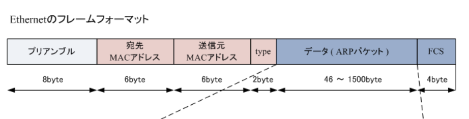

### プロトコル番号一覧表

- プロトコル番号(*IP Protocol Number*)

上位層のプロトコルを識別するための番号であり、IPヘッダの8ビットの情報。プロトコル番号が6の場合はTCP、17の場合はUDP。プロトコル番号の枠は0 ~ 255

- Ciscoで使用する拡張ACL

拡張ACL(100 ~ 199)の`permit / deny`の後に、`ip`または`ipプロトコル番号`を入力することで、Ciscoの拡張ACLを定義できる。Cisco機器ではIPプロトコル番号を入力する代わりにキーワードを指定できる。TCP上でアクセス制限をかけたい場合、6でもTCPでも可能  
1.`access-list 100 permit tcp any any eq www`  
2.`access-list 100 permit 6 any any eq 80`  
どちらも同じ効能のACLだが、1が一般的

### ICMPとは

- ICMP(*Internet Control Message Protocol*)とは

IPプロトコルのエラー通知や制御メッセージを転送するためのプロトコル。TCP / IPが実装されたコンピュータ間で、通信状態を確認するために使用され、インターネット層(OSI参照モデルのネットワーク層)で動作する。ネットワーク診断プログラムの`ping`や`traceroute`はICMPプロトコルを使用したプログラム

- ICMPのフォーマット

ネットワーク層で動作するとはいえ、正確にはIPプロトコルの上位に位置しており、タイプ・コード・チェックサム・データの4フィールドで構成される

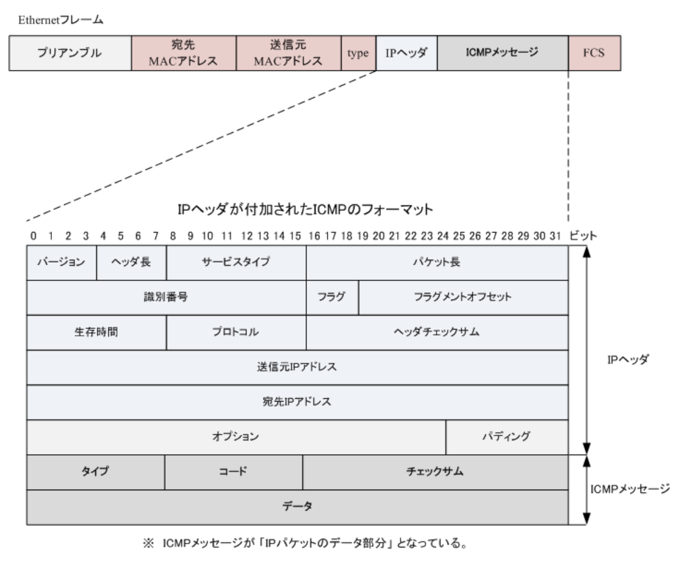

`タイプ`(8bit)  
ICMPメッセージの機能タイプの値が入る  
`コード`(8bit)  
ICMPメッセージの詳細な機能コードの値が入る  
`チェックサム`(16bit)  
エラーがないかチェック  
`データ`(可変長)  
ICMPのタイプにより長さが異なる
