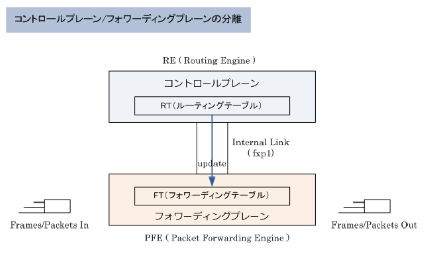

### JUNOSとは

- JUNOSとは

*Juniper Network*の主にルータ製品で搭載しているOSのこと。企業ネットワークに導入しているJuniper製品と言えば*ScreenOS*を搭載したSSGシリーズが代表的だが、実質的にその後継機であるSRXシリーズの搭載OSがJUNOSであることから、JUNOSのスキルは市場価値が高くなっている。SRXでは、`ScreenOSを統合したJUNOS`を搭載

|主な製品カテゴリ|機器|
|-------------|---|
|ルーティング|高機能 / 高性能ルータ|
|スイッチング|高性能スイッチ|
|セキュリティ|Firewall, VPN, UTM|

- JUNOSの特徴

`FreeBSDをベースに開発`されており、`モジューラ型アーキテクチャ`(構成要素が部品化されており、結合することで製品やシステムを結成・開発・製造できるよう形作られたアーキテクチャ)によって高い信頼性を実現。カーネル(OSの中核のソフトウェア)となるJUNOSの上で、モジュールとして動作する各プロセスにそれぞれCPUリソースとメモリ領域が割り当てられるため、特定のプロセスで不具合が発生した場合もOS全体が影響を受けることなく、該当するプロセスだけを再起動等で修復することで正常な状態にできるこれがモジュラー型の最大のメリット

JUNOSが動作するプラットフォームでは`フォワーディングプレーン`(パケット転送)と`コントロールプレーン`(システム制御)が分離されているため、パケット転送によりフォワーディングプレーン側で高負荷になっても、その影響をコントロールプレーン側のルーティング処理が影響を受けることはなく、高い信頼性を実現する

- JUNOS - 認識するストレージ

JUNOS搭載プラットフォームでは起動メディアにCF(コンパクトフラッシュ)、HDD(ハードディスクドライブ)、SSD(フラッシュメモリドライブ)、USBメモリなどが使用できてストレージとして認識する。なお、SRXシリーズでは、SRX1400以上のモデルでRE(ルーティングエンジン)にSSDまたはHDDが搭載されている。JUNOS搭載プラットフォームがブートする際にストレージを参照する優先順位は、USBメモリ => コンパクトフラッシュ => HSS / SSDの順

|SRXシリーズ|ストレージ|
|----------|--------|
|SRX100 / SRX210 / SRX220 / SRX240|1GB CF|
|SRX650|2GB CF|
|SRX1400 / SRX3400 / SRX3600|1GB CF + 16GB SSD|
|SRX5600 / SRX5800|1GB CF + 40GB HDD|
