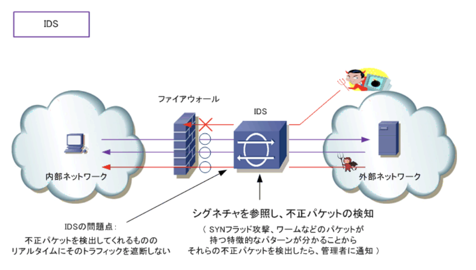
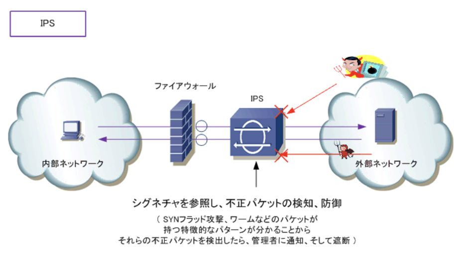

### オープンネットワークとクローズドネットワーク

- ネットワークセキュリティとは

デジタルの情報資産を保護するための防衛策、コンピュータネットワークにおける安全運用を維持するための防衛策のこと。ネットワークセキュリティを確保するためには外部からのクラッキングなどを防止したり、内部においては`データの不正な持ち出しを防止`する必要がある

- ネットワーク形態ごとのネットワークセキュリティ

直接的(間接的)にインターネットや外部と接続している`オープンネットワーク`、完全に外部と接続していない`クローズドネットワーク`の2つに分かれ、形態によってセキュリティ対策は異なる。  
クローズドネットワークの場合、不正利用者や産業スパイがいなければ安全性を実現したネットワークだが、`内部のネットワークには不正利用者がいる`という前提で考えることが必要。USBなどの持ち出し媒体などによるデータの不正な持ち出しだけでなくソーシャルエンジニアリングもある

- オープンネットワークにおけるセキュリティ対策

インターネットなどの外部接続を行っていることから、外部から不正アクセスを防止することが最も重要なセキュリティ対策となる。不正アクセスだけでなく、Webサイトのデータ改ざんやウイルス感染の防止も必要

### 攻撃者と攻撃手法

- 攻撃者

ネットワークシステムにおける攻撃者は`クラッカー`と呼ばれる。機密情報の収集、データの破壊、情報サービスの妨害などの目的でクラッキングを行う。これらの対策としてFirewall、IDS、IPSのネットワーク製品により防衛を行い、各コンピュータはウイルス対策ソフト等で防衛を行う

### FireWall / IDS / IPS / DMZ

- ネットワークセキュリティ - ファイアウォール

インターネットなどの外部ネットワークから、社内ネットワークなどの内部ネットワークへの不正なアクセスを防止するシステム。ルータなどの機器にファイアウォールの機能を持たせる構成や、ファイアウォール専用のハードウェアとしての構成がある。ファイアウォールの基本実装として外部から発生するトラフィックは拒否し、内部から外部へ発生したトラフィックの戻りのトラフィックは許可させる。これはファイアウォールのステートフルインスペクションと呼ばれる機能を利用することで実現している。  
ファイアウォールで通信許可された設定がない限りは、外部ネットワークからパケットが着信できないが、パケットが悪意のあるトラフィックか確認できないので、DoS攻撃やワームなどのトラフィックを防ぐことはできない。IDS、IPSの導入の必要が出てくる

- ネットワークセキュリティ - IDS(*Instruction Detection System*)

侵入検知システム。不正アクセスなどの悪意あるトラフィックを検出して通知する。Firewall前に置かれたIDSは、ネットワーク上を流れるトラフィックを監視していて、不正アクセスと思われるパケットを検知すると、システム管理者に通知する。不正アクセスの判断は`シグネチャ`と呼ばれる攻撃パターンのDBを使用し、この侵入検知の通知を受けて、管理者はファイアウォールのフィルタリングを強化して攻撃に備える。  
ファイアウォールとの組み合わせによりセキュリティ強度が増す一方、IDSはあくまで検知するシステムなので、ネットワーク管理者がその検知した内容に基づいてセキュリティ制御をしない限り攻撃を防止することはできず、リアルタイムに攻撃を阻止することはできない

- ネットワークセキュリティ - IPS(*Instruction Prevention System*)

侵入防止システム。不正アクセスなどの悪意あるトラフィックを検出して通知するだけでなく、シグネチャを参照し不正アクセスに該当するパケットを破棄したりセッションを切断して即座に防御する、セキュリティ実装の要の位置付け。侵入を検知したらリアルタイムに防御をするので、ワームやDoSなどのパケットが持つ特徴をとらえた瞬間、直後に自動的に防衛を開始することから、手間のかかる管理メンテナンスは発生しない

- ネットワークセキュリティ - ファイアウォール導入時のネットワーク構成

企業ネットワークにファイアウォールを導入する場合、内部ネットワーク、外部ネットワーク、`DMZ`(*DeMilitarized Zone* : 非武装地帯)の最低3つに分離するのが一般的

`内部ネットワーク`  
企業の社内ネットワークなどの内部のネットワークで、Trustネットワークとも呼ばれる

`外部ネットワーク`  
インターネットなどの外部のネットワークで、Untrustネットワークとも呼ばれる

`DMZ`  
内部、外部ネットワークの両方から隔離されたネットワーク。外部ネットワークのユーザに公開するサーバを導入するネットワーク。公開サーバを配置しておくことで、サーバを不正に乗っ取られた場合でも内部ネットワークへの不正アクセスを防止できる
