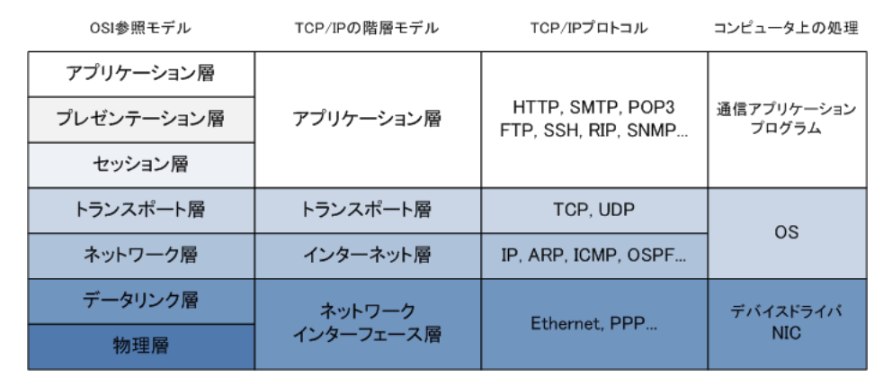
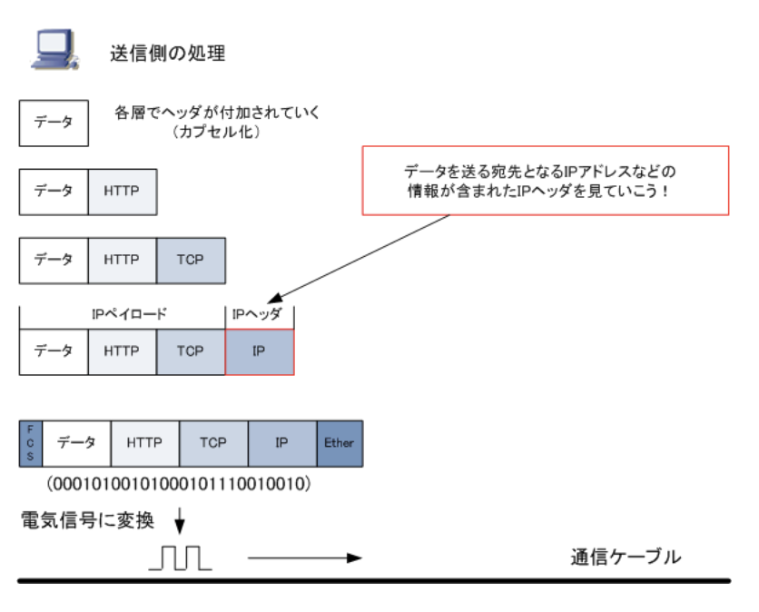
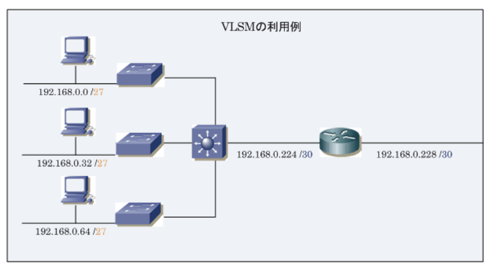
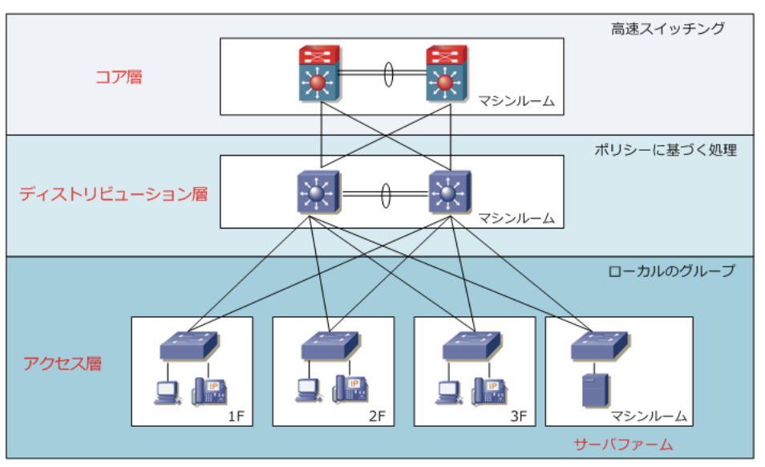

### 用語

- グレートファイアウォール(検閲システム)  
ファイアウォールは通常、インターネット(WAN)と企業や組織のイントラネット(内部のLAN)の境界に設置する。この考え方を国境にまで広げたもの。国境をまたぐ通信を制御しており、政府が禁止しているWebサイトからの通信や、禁止しているWebサイトへの通信を、IPアドレスやURLなどによって遮断している

- *FortiGate*  
ファイアウォール機能に加え、ウイルス対策、迷惑メール対策、Sandbox機能やWebフィルタリングなど、複数のセキュリティ機能を統合しており、多面的な脅威に対抗できるUTM(統合脅威管理)。ネットワーク内にマルウェアが持ち込まれた際も、マルウェアがC&Cサーバ(マルウェアに命令を送るサーバ)と行う通信をブロックするため、動きを封じることが可能

- プロトコルとは

コンピュータなどの機器同士で通信を行うために取り決められた約束ごと。約束ごとは「コンピュータ間でどのようにデータを送るのか、どれだけのデータを送るのか」ということ。コンピュータ間をただLANケーブルなどで物理的に接続しただけでは、相互に通信することができないが、このプロトコル(IPやTCP等)を使用することで、コンピュータとコンピュータを通信できる

- ストレージとは

デジタル情報を記憶・保存する装置のことで、ハードディスク・MO・CD-R・磁気テープなどが該当する。ストレージの接続形態にはDAS、NAS、SANの大きく3種類。ストレージをサーバなどに直接接続する形態は`DAS`(*Direct Attached Storage*)、ストレージをネットワーク上に接続する形態には`NAS`(*Network Attached Storage*)と`SAN`(*Storage Area Network*)の2種類がある。NASやSANの接続形態によって利用するストレージのことを`ネットワークストレージ`と呼ぶ

- TCP / IP(*Transmission Control Protocol / Internet Protocol*)とは

現在のインターネット通信およびイントラネット通信において最も利用されている通信プロトコル。TCP / IPは複数のプロトコルからなるが、中心的な役割を果たすのがTCPとIPであることからTCP / IPと呼ばれるようになった

- `リピータハブ` : レイヤ1(物理層)デバイスとして定義される。ハブは送り先を制御できず、あるポートで受信したデータを、他のすべてのポートから送信する  
- `スイッチ(スイッチングハブ)` : 複数のネットワークセグメントを相互に接続する集線装置。レイヤ2のデバイスであるが、ハードウェアでフレームの処理ができるためブリッジよりも高速。レイヤ3スイッチのルーティング機能を追加した場合、レイヤ3スイッチとなる  
- `ブリッジ` : レイヤ2(データリンク層)のデバイス。複数のネットワークセグメントを相互に接続する。現在はブリッジの代わりにスイッチが使用されている  
- `ルータ` : レイヤ3(ネットワーク層)デバイス。`複数のネットワークを相互に接続`する。離れたネットワークへデータを転送するためにルーティング処理を行うほか、メディア変換やパケットフィルタリングなどの機能を持つ。

- IP(*Internet Protocol*)とは

OSI参照モデルでは`ネットワーク層`で動作し、TCP / IP階層モデルでは`インターネット層`で動作するプロトコル。IPは論理アドレス(IPアドレス)を各ノードに割り当てることで、各ノードを識別することができる。このIPアドレスの宛先を確認することで、あるノードから別のノードへデータを送信することができる。IPアドレスの宛先情報については`IPヘッダ`に含まれている

- ARP(*Address Resolution Protocol*)とは

`IPアドレスからEthernetのMACアドレスの情報を得られる`プロトコル。LANに接続されたコンピュータ間で通信するためには、IPパケットは下位のレイヤでL2ヘッダが付加された上で伝送されることからMACアドレスの情報が必要となる。しかしこれらのIPアドレスとMACアドレスは自動的な関連付けがないので、ARPでMACアドレスを得る必要がある。TCP / IPを利用したコンピュータのLAN通信では、IPアドレスとMACアドレスが分かることで通信できる

- RARP(*Reverse Address Resolution Protocol*)とは

`EthernetのMACアドレスからIPアドレスの情報を得る`ことのできるプロトコル。ARPとは逆の動きのこのプロトコルは、現在ほぼ使用されていない。IPアドレスを持たないと通信できない機器であるにも関わらず、IPアドレスの設定ができない(またはIPアドレスの設定が保存できない)機器がある場合に使用される。  
このような機器は起動時には自身のIPアドレスは分からないが、インターフェイスのハードウェア部分にMACアドレス情報としては保持していることから、RARPリクエストをすることで、RARPサーバからIPアドレスを取得できる

- GARPとは

*Gratuitous ARP*はARPパケットの1つで、2つの役割を持っているプロトコル。  
・自身に設定する`IPアドレスが重複していないか検出する`  
・同一セグメントのネットワーク機器上のARPキャッシュを更新させる  
GARPは、自身に設定するIPアドレスに対するARPのこと。通常のARPでは宛先のIPアドレスに対して宛先のMACアドレスを得ようとするが、GARPでは自身のIPアドレスに対して自身のMACアドレスを得ようとする。上記の2つの役割を実現するため、自身のMACアドレスは知っていても自身のIPアドレスに対してARPを行う必要がある

|    |説明|
|----|---|
|ARP |相手のIPアドレスからMACアドレスを得る|
|RARP|MACアドレスから自身のIPアドレスを得る|
|GARP|自身のIPアドレスが重複していないか検出する 同一セグメントのネットワーク機器上のARPキャッシュを更新させる|

- ICMP(*Internet Control Message Protocol*)とは

IPプロトコルのエラー通知や制御メッセージを転送するためのプロトコル。TCP / IPが実装されたコンピュータ間で、通信状態を確認するために使用され、インターネット層(OSI参照モデルのネットワーク層)で動作する。ネットワーク診断プログラムの`ping`や`traceroute`はICMPプロトコルを使用したプログラム

- tracerouteとは

ICMPプロトコルを使用したネットワークの診断プログラム。使用するコマンドはWindowsの場合は`tracert`、Cisco機器の場合は`traceroute`というコマンド。あるホストから宛先のホストまでに到達するためにどのネットワーク経路を使用しているのかが分かり、宛先ノードまでのネクストホップアドレス(ルーティングで次にパケットを転送する隣接ルータのIPアドレス)の一覧が表示される

- TCP(*Transmission Control Protocol*)とは

IPと同様にインターネットにおいて標準的に利用されているプロトコルで、IPの上位プロトコルで`トランスポート層で動作`する。ネットワーク層のIPとセッション層以上のプロトコルの橋渡しをする形で動作している。TCPは`信頼性の高い通信を実現する`ために使用されるプロトコルに対して、UDPは信頼性は高くないが高速性やリアルタイム性を求める通信に使用されるプロトコル。優劣はなく、通信特性によりTCP / UDPは使い分けされる

- ポート番号とは

コンピュータが通信を行うために通信先の`アプリケーションを特定するための番号`のこと。コンピュータ間の通信で通信する宛先のIPアドレスが分かれば、そのIPアドレスにデータを送信できるが、そのデータを受信したコンピュータが、どのアプリケーションでそれを受信するのか判断するために必要。  
コンピュータ上でWebブラウザとメーラを起動させていたとする。Webブラウザでインターネットを閲覧するために、コンピュータ内でデータをWebブラウザに送り届ける必要がある。TCPヘッダにポート番号情報が付加することで、どのアプリケーションなのかを識別し、これを実現している

- IPアドレスとは

インターネットやLANなどのIPネットワークに接続されたコンピュータなどに割り振られる識別番号のこと。IPアドレスは、IPネットワーク上の住所、電話番号のようなもの。  
コンピュータ内部では2進数で処理されることから、32ビットの整数値で表されるが2進数はわかりにくいため、32ビットの整数値を8ビットずつ4分割して10進数でIPアドレスを表す。  
IPアドレスによって互いの場所を識別しているため、PCとサーバの通信が成立する

- VLSM(*Variable Length Subnet Mask*)とは

1つのIPネットワークをサブネットに分割する際に、複数の長さのサブネットマスクを利用する技術で、`可変長サブネットマスク`とも呼ばれる。クラスの概念にとらわれない`クラスレスアドレッシング`の手法の1つと言える。`効率的なアドレッシング`が実現できるが、対応していないクラスフルルーティングプロトコル(RIPv1)が稼働しているネットワークでは使用できない

- CIDR(*Classless InterDomain Routing*)とは

IPネットワークの経路情報を集約する際にクラスの概念をなくした技術のこと。CIDRにより複数のクラスCアドレスを1つのネットワークに集約することができ、集約したネットワークは`SuperNet`(元のクラスのナチュラルマスクよりも短いマスクの経路)と呼ぶ。  
これによって、200.0.0.0 / 24 ~ 200.0.7.0 / 24の8つのネットワークを、1つのネットワークに集約して200.0.0.0 / 21として扱うことができる。インターネット上である組織がクラスCのネットワークではIPアドレスが足らないことからクラスBのネットワークを取得を希望した場合、クラスBのネットワークを付与するのではなく、必要としているIPアドレスの数と同じくらいの数となるよう、連続する複数のクラスCのネットワークを、1つのネットワークとして割り当てればIPアドレス空間を有効利用できる。  
VLSMの場合は複数の異なるサブネットを作成していく時に`ホスト部のビット`を消費していくのに対し、CIDRの場合は複数のネットワークを1つのネットワークにする時に`ネットワーク部のビット`を消費していく。CIDRでは1つの大きなネットワークを作成するためにホスト部のビットを増やしている

- ゼロサブネットとは

サブネット部が全て0のネットワークのこと。172.16.10.0 / 24の場合はサブネット部が全て0ではないが、172.16.0.0 / 24の場合は全て0になり、ゼロサブネットに該当する。従来のサブネット計画においては、サブネット部が全て0または1のネットワークは推奨されていなかった。172.16.0.0 / 24(ゼロサブネット)は、元のネットワーク172.16.0.0 / 16とネットワークアドレスが同じで混同してしまう。サブネット部が全て1の172.16.255.0 / 24は、元のネットワーク172.16.0.0 / 16とブロードキャストアドレスが同じであるため混同してしまう。しかし、現在のネットワーク機器では解決されており、サブネット計画でどちらも使用することは可能

- NAT(*Network Address Translation*)とは

`IPアドレスを変換する技術`。一般的には、プライベートIPアドレスをグローバルIPアドレスに変換する技術とされている。インターネットはグローバルIPアドレスを使用して構築したネットワークだが、企業ネットワークでは、プライベートIPアドレスを使用して構築されたネットワークなので、企業LANネットワークのクライアントPCがインターネット接続する場合、プライベートIPアドレスをグローバルIPアドレスに変換する必要がある

- NAT用語

`内部ローカルアドレス`(*Inside local*)  
内部ネットワークのホストに割り当てられるIPアドレス(企業LANで割り当てられるプライベートIPアドレス)  
`内部グローバルアドレス`(*inside Global*)  
外部ネットワークから見た、内部ネットワークのホストのIPアドレス(ISPから割り当てられるグローバルIPアドレス)  
`外部ローカルアドレス`(*Outside local*)  
内部ネットワークから見た、外部ネットワークのホストのIPアドレス(グローバルIPアドレス)  
`外部グローバルアドレス`(*Outside global*)  
外部ネットワークのホストに割り当てられるIPアドレス(グローバルIPアドレス)

- NAPT(*Network Address Port Translation*)とは

`1つのIPアドレスを複数のコンピュータで共有`するためのアドレス変換技術のこと。IPアドレスの変換だけでなく、TCP / UDPのポート番号も含めて変換することで、1つのIPアドレスを複数のコンピュータで共有することを実現している。  
IPネットワークの境界にあるルータが双方のIPアドレスとTCP / UDPポート番号を自動的に変換することでプライベートIPアドレスで通信している複数のコンピュータが内部ネットワークから、1つのグローバルIPアドレスを共有してインターネット通信できるようになる。  
CiscoではNAPTをPAT(*Port Address Translation*)と呼んでおり、LinuxではIPマスカレードと呼んでいる

- *IP Unnumbered*とは

`WAN側にIPアドレスを割り当てずにLAN側のIPアドレスを借りる設定`のこと。IPアンナンバードにより、ルータのWAN側ポートにIPアドレスを割り当てることなくLAN側ポートだけにIPアドレスを割り当てることで、2台のルータをまるで1台のルータのように扱うことも可能。この技術を使用することで、割り当てるIPアドレスを節約することができる。下図ではWAN側に192.168.254.0 / 30のセグメントを割り振っている

- イーサネット(*Ethernet*)とは

コンピュータネットワークの規格のひ1つで、現在最も使用されている`LANの規格`。現在のLANにおけるコンピュータ通信では、イーサネットとTCP / IPの組み合わせが一般的。イーサネットが主に物理規格を取り決めて、TCP / IPが通信内容を取り決めているということ

- CSMA / CDとは

*Carrier Sense Multiple Access with Collision Detection*の略。イーサネットが採用している通信方式の1つで、初期イーサネットLANで使用されていたアクセス制御方式。10Base5、10Base2といった同軸ケーブルを使用したバス型のトポロジーや、10Base-T / 100Base-TXのケーブルの場合でも半二重通信しかサポートしないハブを使用したスター型トポロジーでも、CSMA / CD方式は使用される

- ネットワークの階層設計 : 3階層ネットワーク

企業LANのネットワークには一般的に階層設計が適用されている。役割や機能ごとに層を分けることで拡張性、管理性を向上することができる。階層には`アクセス層`、`ディストリビューション層`、`コア層`の3層がある。LANの規模により物理、論理構成は異なる

`アクセス層`  
クライアントPCやIP-Phoneなどのユーザのデバイスが接続する層。アクセス層に配置されるアクセススイッチは一般的にL2スイッチ。アクセス層はディストリビューション層と接続する

`ディストリビューション層`  
各フロアのアクセススイッチを束ねて、ポリシーに基づいてトラフィック転送、拒否、ルーティング処理を行う。ディストリビューション層のディストリビューションスイッチには一般的にL3スイッチが使用される。必要に応じてコア層にトラフィックを転送する

`コア層`  
配下のディストリビューションスイッチを束ね、企業ネットワークのバックボーンとして機能。コア層に配置されるコアスイッチは、大容量のトラフィックを高速スイッチングできる*Nexus*などの信頼性の高い高機能スイッチを選定する必要がある。大規模な企業LANに適用する階層

- ルーティングとは

宛先となるホストまでパケットを送信する時に最適な経路を選択して転送すること。ルーティングは、`ルータ`や`L3スイッチ`などのレイヤ3で動作するネットワーク機器によって行われます。ルータは最適な経路を決定するためにルーティングテーブルを参照する。ルーティングテーブルは、受信したパケットをどこへ転送するべきかを決定するための宛先ルートの一覧情報。ルータはルーティングテーブルを参照し、ルーティングの際に受信パケットの宛先アドレスを見て転送している。下記原則がある  
・ルーティングテーブル上に存在しない宛先ネットワーク宛のパケットは破棄し、パケットの送信元へ宛先到達不能(*Destination Unreachable*)メッセージをICMPパケットで通知する  
・受信パケットの宛先IPアドレスに該当するルート情報がルーティングテーブルに複数ある場合、`ロンゲストマッチ`の法則に従いパケットを転送する

- アドミニストレーティブディスタンス(AD)とは

1台のルータには、スタティックルートとダイナミックルートを混在させられる。また、1台のルータに複数のルーティングプロトコルを設定できる。宛先ルートをスタティックルートとして保持するだけではなく、RIPによるダイナミックルートとして受信しているとする。このような場合、ルータは信頼度の高いルーティングプロトコルからの情報だけをルーティングテーブルに登録する。この`信頼度を決めるための値`がアドミニストレーティブディスタンス
